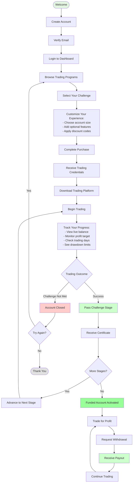
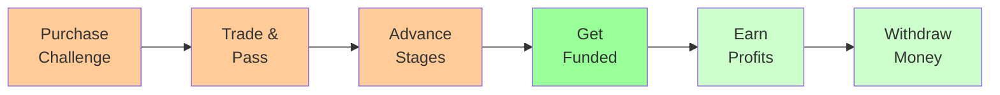

# Client User Journey

## Your Path to Funded Trading

## Your Journey Stages

### 1. Getting Started
- **Create Account**: Quick registration with email verification
- **Browse Programs**: Explore different challenge types and account sizes
- **Customize**: Select features that match your trading style

### 2. Challenge Phase
- **Trade**: Execute your trading strategy
- **Monitor**: Track your progress in real-time
- **Pass**: Meet profit targets while following trading rules

### 3. Funded Trading
- **Trade Live**: Trade with real capital
- **Earn Profits**: Keep 70-90% of your profits
- **Withdraw**: Request payouts regularly

## Success Path

## What You'll Experience

### Real-Time Dashboard
- Live account balance
- Current profit/loss
- Progress toward targets
- Trading statistics
- Performance metrics

### Clear Milestones
- Profit targets to achieve
- Trading days to complete
- Risk limits to maintain
- Certificates earned

### Support Throughout
- Email notifications
- Dashboard updates
- Achievement alerts
- Next step guidance

---

**Your trading journey starts here. Each step is designed to help you succeed.**
