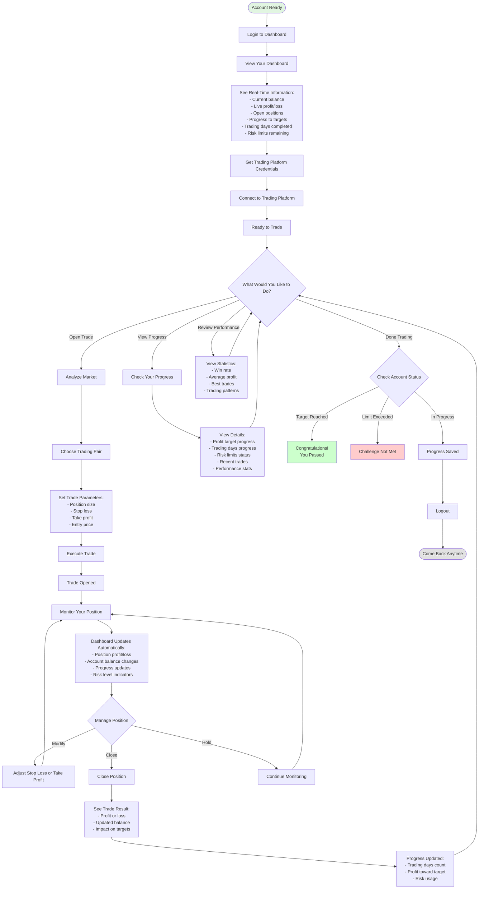
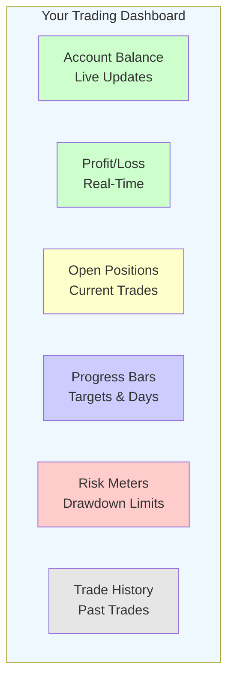
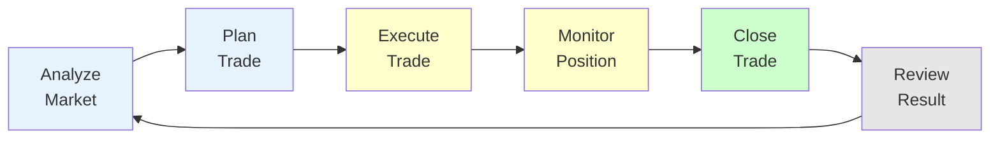
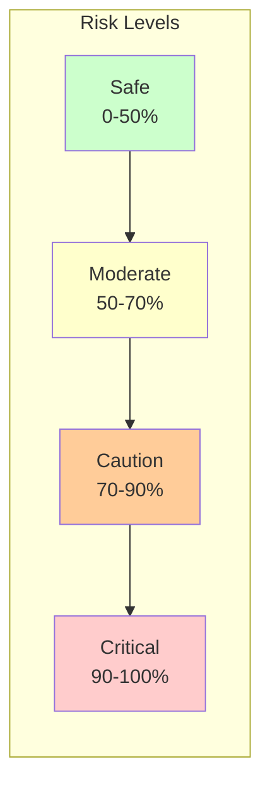

# Trading Experience

## What You See and Do While Trading

## Your Dashboard View

## What You Track

### Profit Progress
- **Current Profit**: How much you've earned
- **Target Profit**: Goal to reach
- **Progress Bar**: Visual indicator of how close you are
- **Percentage**: Exact progress toward target

### Trading Days
- **Days Completed**: Number of days you've traded
- **Days Required**: Minimum days needed
- **Calendar View**: Which days count
- **Remaining**: Days left to complete

### Risk Management
- **Daily Limit**: Maximum loss allowed per day
- **Total Limit**: Maximum loss allowed overall
- **Current Usage**: How much risk you've used
- **Safe Zone**: Visual indicator of risk level

### Performance Metrics
- **Win Rate**: Percentage of winning trades
- **Average Profit**: Typical profit per trade
- **Best Trade**: Your most profitable trade
- **Total Trades**: Number of trades executed

## Trading Flow

## Real-Time Updates

### What Updates Automatically
- **Balance**: Changes with every trade
- **Profit/Loss**: Updates continuously while positions are open
- **Progress Bars**: Move as you get closer to targets
- **Risk Meters**: Adjust based on your trading
- **Trade History**: New trades appear instantly

### Notifications You Receive
- **Trade Executed**: Confirmation when trade opens
- **Trade Closed**: Notification when position closes
- **Milestone Reached**: Alerts for important achievements
- **Risk Warning**: Notice if approaching limits
- **Target Achieved**: Celebration when you pass

## Risk Indicators

### What Each Level Means
- **Safe (Green)**: Plenty of room to trade
- **Moderate (Yellow)**: Be mindful of risk
- **Caution (Orange)**: Trade carefully
- **Critical (Red)**: Very close to limit

## Trading Tips

### Best Practices
- **Monitor regularly**: Check your dashboard often
- **Use stop losses**: Protect your account
- **Track progress**: Know where you stand
- **Stay within limits**: Respect risk boundaries
- **Review trades**: Learn from each trade

### Dashboard Features
- **Live charts**: See market movements
- **Position details**: Full trade information
- **Quick actions**: Modify or close trades easily
- **Export data**: Download your trading history
- **Mobile access**: Trade from anywhere

---

**Your dashboard is your command center. Everything you need to succeed is at your fingertips.**
