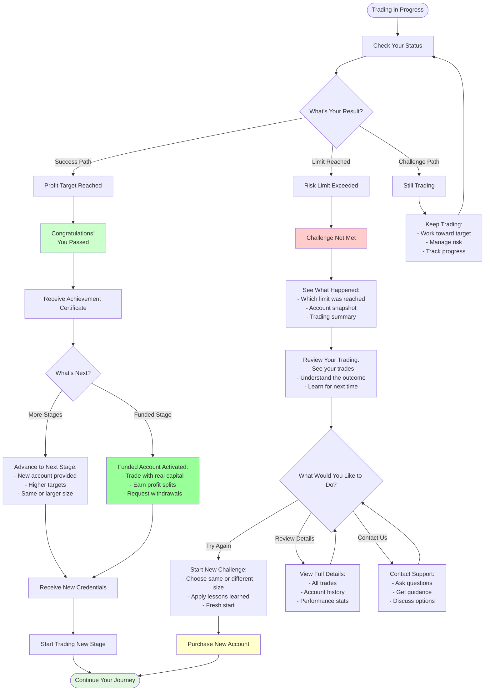
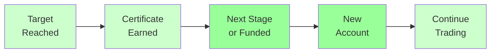
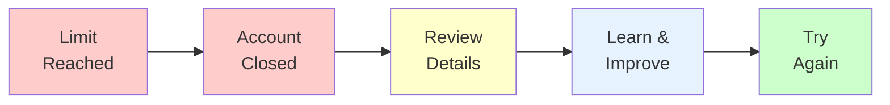
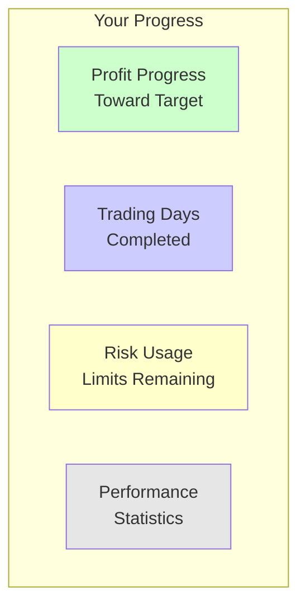

# Account Outcomes

## Understanding Your Results

## Success Outcomes

### When You Pass

#### What Happens
1. **Immediate Recognition**: Dashboard shows success message
2. **Certificate Issued**: Professional achievement certificate
3. **Email Notification**: Congratulations email with details
4. **Next Steps**: Clear instructions for advancement

#### What You Receive
- **Achievement Certificate**: Proof of your success
- **Progress Summary**: Your trading performance
- **Next Stage Details**: Information about advancement
- **New Credentials**: Access to next account (if applicable)

### Advancement Paths

| Current Stage | Next Stage | What Changes |
|--------------|------------|--------------|
| **Phase 1** | Phase 2 or Funded | Higher targets, new account |
| **Phase 2** | Phase 3 or Funded | Final evaluation or funded |
| **Phase 3** | Funded Account | Real trading begins |
| **Funded** | Continue Trading | Keep earning and withdrawing |

## Challenge Outcomes

### When Limits Are Reached

#### What Happens
1. **Notification**: Dashboard shows outcome
2. **Summary Provided**: See what happened
3. **Account Closed**: Trading stops on this account
4. **Options Presented**: Clear next steps available

#### What You See
- **Clear Explanation**: Which limit was reached
- **Trading Summary**: Your trades and performance
- **Account Snapshot**: Final account state
- **Learning Points**: Understand the outcome

### Common Scenarios

#### Daily Loss Limit
- **What it means**: Maximum daily loss reached
- **Why it matters**: Protects your account
- **Next time**: Manage daily risk better

#### Total Loss Limit
- **What it means**: Overall loss limit reached
- **Why it matters**: Account protection rule
- **Next time**: Use better risk management

#### Trading Rules
- **What it means**: A trading rule wasn't followed
- **Why it matters**: Rules ensure fair evaluation
- **Next time**: Review and follow all rules

## Your Options After Challenge

### Option 1: Start Fresh
- **New Challenge**: Purchase a new account
- **Same or Different**: Choose any size or type
- **Apply Learning**: Use experience from previous attempt
- **Fresh Start**: Clean slate with new account

### Option 2: Review and Learn
- **Study Trades**: Analyze what happened
- **Identify Patterns**: See where to improve
- **Understand Rules**: Review requirements
- **Plan Better**: Develop improved strategy

### Option 3: Get Support
- **Ask Questions**: Contact support team
- **Get Guidance**: Understand your results
- **Discuss Options**: Explore possibilities
- **Receive Help**: Get assistance with next steps

## Progress Tracking

### While Trading

### Status Indicators
- **Green**: On track, good progress
- **Yellow**: Approaching limits, be careful
- **Red**: Very close to limits, trade cautiously

## Understanding Your Results

### Success Metrics
- **Profit Target**: Did you reach the goal?
- **Trading Days**: Did you trade enough days?
- **Risk Management**: Did you stay within limits?
- **Rule Compliance**: Did you follow all rules?

### Performance Review
- **Win Rate**: Percentage of winning trades
- **Average Profit**: Typical profit per trade
- **Risk Usage**: How much risk you used
- **Consistency**: Trading pattern quality

## Moving Forward

### After Success
1. **Celebrate**: Acknowledge your achievement
2. **Prepare**: Get ready for next stage
3. **Continue**: Keep improving your skills
4. **Advance**: Progress toward funded trading

### After Challenge
1. **Review**: Understand what happened
2. **Learn**: Identify improvement areas
3. **Plan**: Develop better strategy
4. **Retry**: Start fresh when ready

## Support Resources

### Available Help
- **FAQ**: Common questions answered
- **Trading Tips**: Improve your strategy
- **Rule Guides**: Understand requirements
- **Support Team**: Personal assistance

### Contact Options
- **Email Support**: Detailed inquiries
- **Live Chat**: Quick questions
- **Help Center**: Self-service resources
- **Community**: Connect with other traders

---

**Every outcome is a learning opportunity. Success or challenge, we're here to support your journey.**
