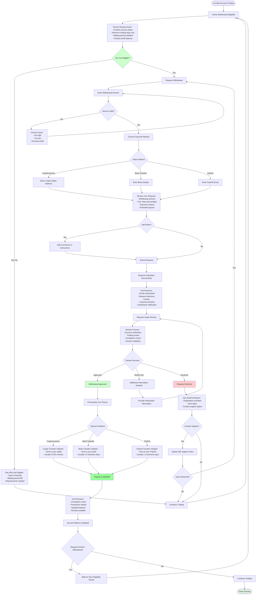
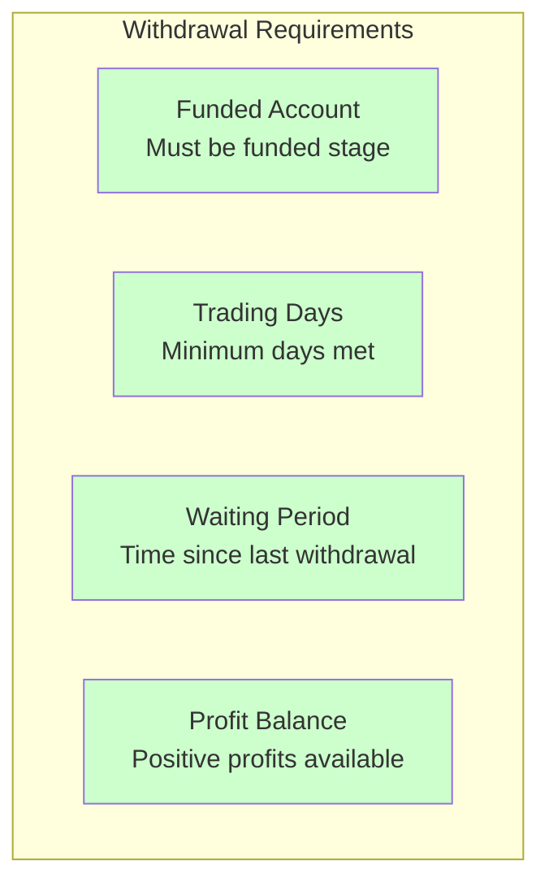
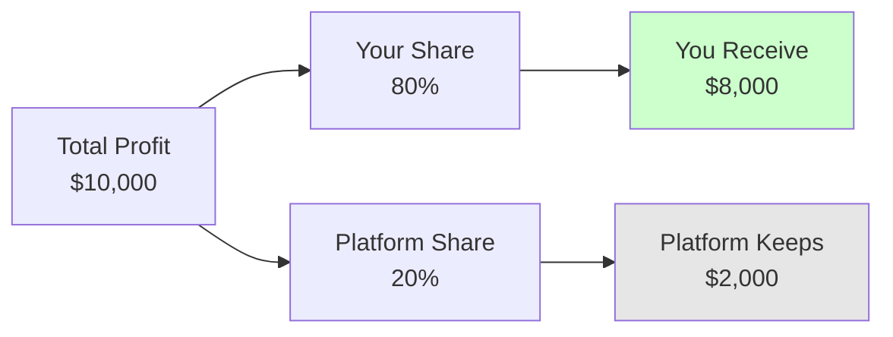
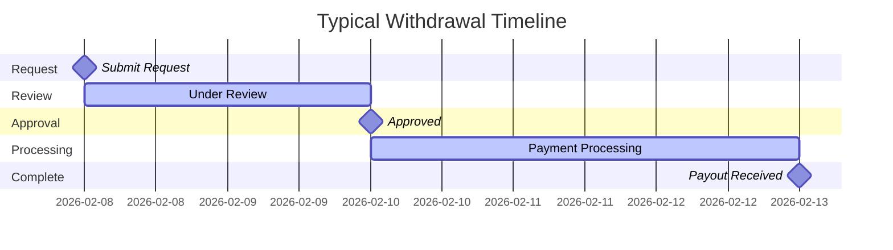

# Withdrawal Process

## Getting Your Profits Paid Out

## Eligibility Requirements

### What You Need

#### Typical Requirements
- **Account Status**: Must be in funded stage
- **Trading Days**: Usually 5-10 days of trading
- **Waiting Period**: Usually 7-14 days between withdrawals
- **Profit Balance**: Must have profits to withdraw

### Check Your Eligibility

Your dashboard shows:
- **Current Status**: Eligible or not eligible
- **Days Completed**: Trading days count
- **Next Eligible Date**: When you can withdraw next
- **Available Profit**: Amount you can withdraw

## Payment Methods

### Cryptocurrency
- **Speed**: 10-60 minutes
- **Fees**: Low (0.5-1%)
- **What You Need**: Crypto wallet address
- **Best For**: Fast payouts

### Bank Transfer
- **Speed**: 3-5 business days
- **Fees**: Moderate
- **What You Need**: Bank account details
- **Best For**: Traditional banking

### PayPal
- **Speed**: 1-2 business days
- **Fees**: Moderate (2.9%)
- **What You Need**: PayPal email
- **Best For**: Convenient transfers

## Your Profit Share

### Understanding Profit Splits
- **Your Share**: Typically 70-90% of profits
- **Platform Share**: Typically 10-30% of profits
- **Clear Display**: See exact amounts before submitting
- **No Hidden Fees**: What you see is what you get

## Withdrawal Timeline

### Expected Timeframes
1. **Submission**: Instant
2. **Review**: 1-3 business days
3. **Processing**: Varies by method
4. **Receipt**: Based on payment method

## What Happens During Review

### We Check
- **Account Status**: Verify funded account
- **Trading Activity**: Review your trades
- **Compliance**: Ensure rules followed
- **Amount**: Validate withdrawal amount

### You'll Be Notified
- **Status Updates**: Email notifications
- **Dashboard Updates**: Real-time status
- **Any Questions**: We'll contact you if needed
- **Final Decision**: Approval or decline with reason

## After Approval

### Processing Steps
1. **Payment Initiated**: Transfer starts
2. **In Transit**: Payment being processed
3. **Completed**: Funds delivered
4. **Balance Updated**: Account reflects withdrawal

### What You Receive
- **Confirmation Email**: Payment details
- **Transaction ID**: Reference number
- **Receipt**: Downloadable proof
- **Updated Dashboard**: New balance shown

## Withdrawal Limits

### Typical Limits
- **Minimum**: $100-$500 per withdrawal
- **Maximum**: $50,000-$100,000 per withdrawal
- **Frequency**: Based on waiting period
- **Balance**: Cannot exceed available profit

### Your Dashboard Shows
- **Available Amount**: How much you can withdraw
- **Minimum Required**: Lowest amount allowed
- **Maximum Allowed**: Highest amount allowed
- **Next Eligible Date**: When you can withdraw again

## If Request Is Declined

### Common Reasons
- **Insufficient Trading Days**: Need more trading activity
- **Waiting Period**: Too soon since last withdrawal
- **Account Review**: Additional verification needed
- **Amount Issue**: Requested amount not available

### What You Can Do
1. **Review Reason**: Understand why declined
2. **Contact Support**: Get clarification
3. **Meet Requirements**: Fulfill any missing criteria
4. **Resubmit**: Try again when eligible

## Managing Your Withdrawals

### Best Practices
- **Check Eligibility First**: Verify before requesting
- **Accurate Information**: Provide correct payment details
- **Reasonable Amounts**: Stay within limits
- **Plan Ahead**: Consider waiting periods
- **Keep Trading**: Continue earning while waiting

### Track Your Withdrawals
- **Request History**: See all past requests
- **Status Tracking**: Monitor current requests
- **Payment Records**: View completed payouts
- **Total Withdrawn**: Track lifetime earnings

## Support and Help

### Need Assistance?
- **FAQ Section**: Common questions answered
- **Live Chat**: Quick help available
- **Email Support**: Detailed inquiries
- **Help Center**: Self-service resources

### Contact Us About
- **Eligibility Questions**: When can I withdraw?
- **Payment Methods**: Which option is best?
- **Status Updates**: Where is my withdrawal?
- **Technical Issues**: Payment problems

---

**Your earnings, your way. We make withdrawals simple and transparent.**
