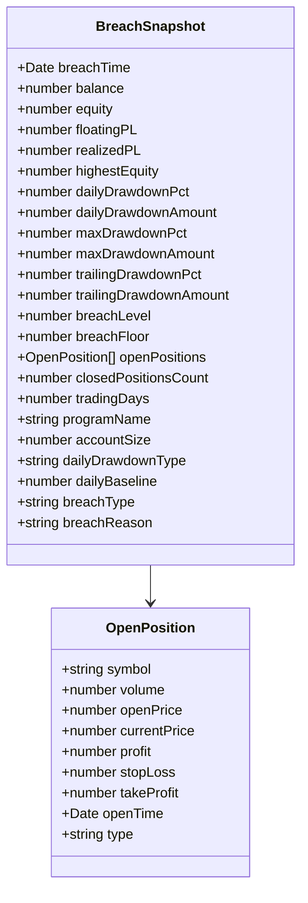
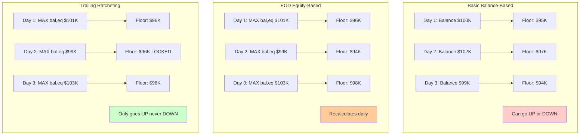
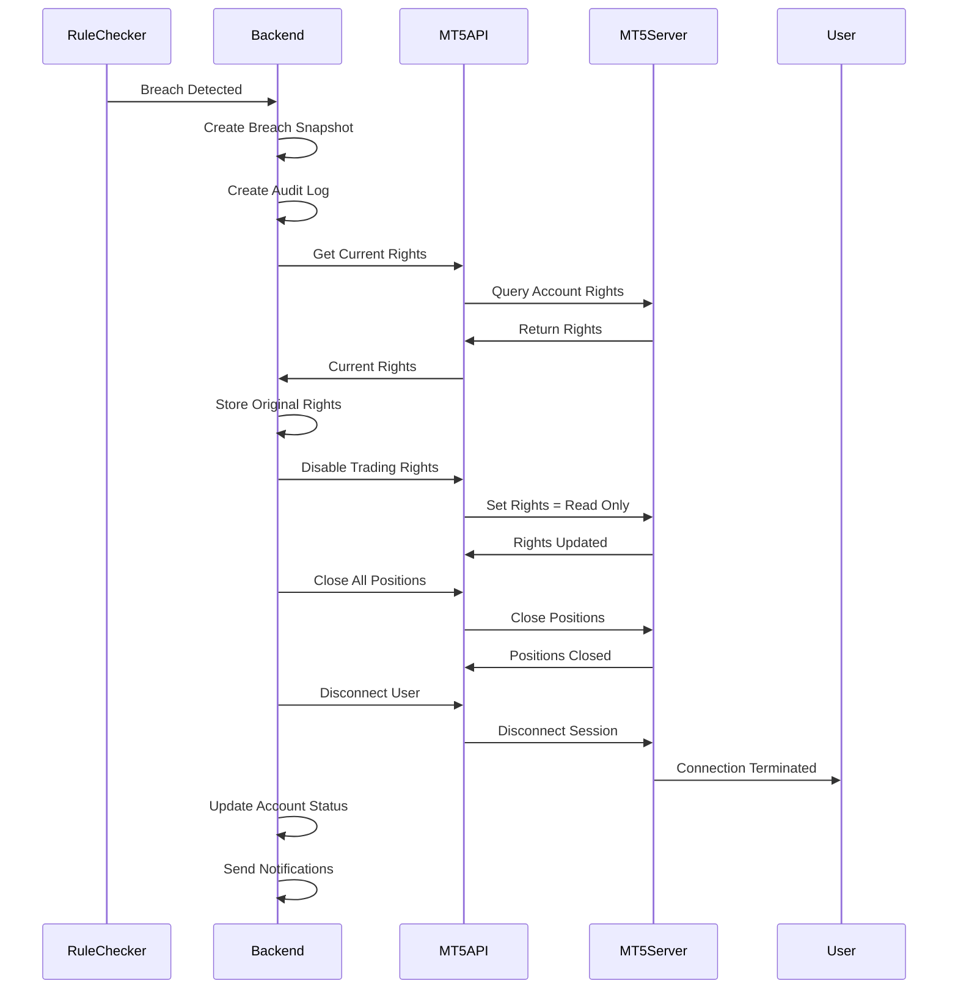
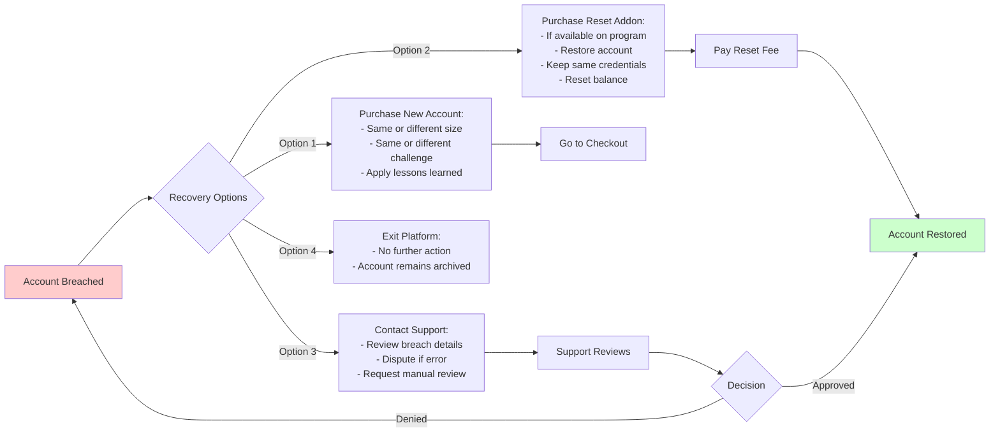

# Breach Detection Flow

## Complete Breach Detection and Account Termination Process

```mermaid
flowchart TD
    Start([Rule Checker Polling]) --> FetchState[Fetch Account State<br/>from MetaAPI]

    FetchState --> UpdateMetrics[Update Pre-computed Metrics:<br/>- Current Balance/Equity<br/>- Highest Equity Ever<br/>- Highest Equity Today<br/>- Lowest Equity Today<br/>- Daily Baseline/Floor<br/>- Peak Drawdowns]

    UpdateMetrics --> RunChecks[Run All Rule Checks]

    RunChecks --> Check1[1. Daily Drawdown Check]
    Check1 --> DDType{Daily Drawdown Type?}

    DDType -->|Basic| BasicDD[Balance-Based:<br/>Baseline = Balance at EOD<br/>Can go up or down]
    DDType -->|EOD| EODDD[EOD Equity-Based:<br/>Baseline = MAX balance equity at EOD<br/>Recalculates daily]
    DDType -->|Trailing| TrailingDD[Trailing:<br/>Baseline = Highest ever at EOD<br/>Only ratchets up]

    BasicDD --> DDViolation{Below Floor?}
    EODDD --> DDViolation
    TrailingDD --> DDViolation

    DDViolation -->|Yes| BreachFound[BREACH DETECTED:<br/>Daily Drawdown]
    DDViolation -->|No| Check2

    Check2[2. Max/Total Drawdown Check]
    Check2 --> MaxDDCalc[Floor = Highest Equity Ever<br/>× 1 - Max DD %]
    MaxDDCalc --> MaxDDViolation{Equity < Floor?}

    MaxDDViolation -->|Yes| BreachFound2[BREACH DETECTED:<br/>Max Drawdown]
    MaxDDViolation -->|No| Check3

    Check3[3. Trailing Drawdown Check]
    Check3 --> TrailCalc[Floor = Highest Equity Today<br/>× 1 - Trailing DD %]
    TrailCalc --> TrailViolation{Equity < Floor?}

    TrailViolation -->|Yes| BreachFound3[BREACH DETECTED:<br/>Trailing Drawdown]
    TrailViolation -->|No| Check4

    Check4[4. Min Trade Duration Check]
    Check4 --> CheckDuration[Check All Closed Trades]
    CheckDuration --> DurationViolation{Any Trade<br/>< Min Duration?}

    DurationViolation -->|Yes| BreachFound4[BREACH DETECTED:<br/>Min Trade Duration]
    DurationViolation -->|No| Check5

    Check5[5. Lot Size Check]
    Check5 --> CheckLots[Check All Positions]
    CheckLots --> LotViolation{Any Position<br/>> Max Lot Size?}

    LotViolation -->|Yes| BreachFound5[BREACH DETECTED:<br/>Lot Size Violation]
    LotViolation -->|No| Check6

    Check6[6. Mandatory Stop Loss Check]
    Check6 --> CheckSL[Check All Open Positions]
    CheckSL --> SLViolation{Any Position<br/>Without Stop Loss?}

    SLViolation -->|Yes| BreachFound6[BREACH DETECTED:<br/>No Stop Loss]
    SLViolation -->|No| Check7

    Check7[7. Mandatory Take Profit Check]
    Check7 --> CheckTP[Check All Open Positions]
    CheckTP --> TPViolation{Any Position<br/>Without Take Profit?}

    TPViolation -->|Yes| BreachFound7[BREACH DETECTED:<br/>No Take Profit]
    TPViolation -->|No| Check8

    Check8[8. Weekend Holding Check]
    Check8 --> CheckWeekend{Is Weekend?}
    CheckWeekend -->|Yes| HasPositions{Has Open<br/>Positions?}
    HasPositions -->|Yes| WeekendAllowed{Weekend<br/>Holding Allowed?}
    WeekendAllowed -->|No| BreachFound8[BREACH DETECTED:<br/>Weekend Holding]
    WeekendAllowed -->|Yes| NoViolation
    HasPositions -->|No| NoViolation
    CheckWeekend -->|No| NoViolation

    BreachFound --> CaptureSnapshot
    BreachFound2 --> CaptureSnapshot
    BreachFound3 --> CaptureSnapshot
    BreachFound4 --> CaptureSnapshot
    BreachFound5 --> CaptureSnapshot
    BreachFound6 --> CaptureSnapshot
    BreachFound7 --> CaptureSnapshot
    BreachFound8 --> CaptureSnapshot

    CaptureSnapshot[Capture Breach Snapshot]
    CaptureSnapshot --> SnapshotData[Snapshot Contains:<br/>- Exact breach timestamp<br/>- Balance & Equity<br/>- Floating P/L<br/>- Realized P/L<br/>- Highest equity<br/>- Drawdown % & amounts<br/>- Breach level & floor<br/>- All open positions<br/>- Closed positions count<br/>- Trading days<br/>- Program details<br/>- Daily DD type & baseline]

    SnapshotData --> CreateAuditLog[Create Breach Audit Log]
    CreateAuditLog --> AuditDetails[Audit Log Contains:<br/>- User ID<br/>- Program ID<br/>- MT5 Account ID<br/>- Breach type<br/>- Breach reason<br/>- Complete snapshot<br/>- Evidence trail<br/>- Timestamp]

    AuditDetails --> MT5Operations[Execute MT5 Operations]

    MT5Operations --> DisableTrading[1. Disable Trading Rights]
    DisableTrading --> StoreRights[Store Original Rights<br/>for Potential Restoration]
    StoreRights --> ClosePositions[2. Close All Open Positions]
    ClosePositions --> DisconnectUser[3. Disconnect User from MT5]

    DisconnectUser --> UpdateAccount[Update User Account]

    UpdateAccount --> SetStatus[Set Account Status:<br/>- accountType: banned<br/>- isBanned: true<br/>- banReason: breach type<br/>- bannedAt: timestamp<br/>- status: archived]

    SetStatus --> StoreSnapshot[Store Breach Snapshot<br/>in User.programs[]]

    StoreSnapshot --> SendNotifications[Send Notifications]

    SendNotifications --> EmailNotif[Email Notification:<br/>- Breach type<br/>- Breach details<br/>- Account snapshot<br/>- Next steps]

    EmailNotif --> InAppNotif[In-App Notification:<br/>- Breach alert<br/>- View details link]

    InAppNotif --> SocketUpdate[Socket.io Real-Time Update:<br/>- Event: breach:detected<br/>- Account status change<br/>- Dashboard refresh]

    SocketUpdate --> AdminNotif[Admin Notification:<br/>- User breached<br/>- Breach type<br/>- Account details]

    AdminNotif --> DashboardUpdate[Update Dashboard Display]

    DashboardUpdate --> ShowBreach[Show Breach Banner:<br/>- Account Breached<br/>- Breach reason<br/>- Breach snapshot<br/>- Purchase new account button]

    ShowBreach --> UserOptions{User Decision}

    UserOptions -->|Buy New Account| Checkout[Go to Checkout]
    UserOptions -->|View Details| ViewSnapshot[View Breach Snapshot]
    UserOptions -->|Contact Support| Support[Contact Support]
    UserOptions -->|Exit| End([End])

    ViewSnapshot --> SnapshotDisplay[Display Snapshot:<br/>- Breach time<br/>- Account state<br/>- Open positions<br/>- Drawdown details<br/>- Trade history]

    SnapshotDisplay --> UserOptions

    Checkout --> NewPurchase[Purchase New Program]

    NoViolation[No Violation Detected]
    NoViolation --> CheckProfit{Profit Target<br/>Reached?}
    CheckProfit -->|Yes| PassFlow[Go to Pass Flow]
    CheckProfit -->|No| ContinueMonitor[Continue Monitoring]
    ContinueMonitor --> Start

    style BreachFound fill:#ff6666
    style BreachFound2 fill:#ff6666
    style BreachFound3 fill:#ff6666
    style BreachFound4 fill:#ff6666
    style BreachFound5 fill:#ff6666
    style BreachFound6 fill:#ff6666
    style BreachFound7 fill:#ff6666
    style BreachFound8 fill:#ff6666
    style ShowBreach fill:#ffcccc
    style PassFlow fill:#ccffcc
```

## Breach Snapshot Data Structure



## Breach Types and Reasons

| Breach Type | Description | Calculation |
|-------------|-------------|-------------|
| DAILY_DRAWDOWN | Daily loss limit exceeded | Balance/Equity < Daily Floor |
| MAX_DRAWDOWN | Total drawdown limit exceeded | Equity < (Highest Ever × (1 - Max DD%)) |
| TRAILING_DRAWDOWN | Trailing drawdown limit exceeded | Equity < (Highest Today × (1 - Trailing DD%)) |
| MIN_TRADE_DURATION | Trade closed too quickly | Close Time - Open Time < Min Duration |
| LOT_SIZE_VIOLATION | Position size too large | Position Volume > Max Lot Size |
| NO_STOP_LOSS | Missing mandatory stop loss | Position has no SL when required |
| NO_TAKE_PROFIT | Missing mandatory take profit | Position has no TP when required |
| WEEKEND_HOLDING | Holding positions over weekend | Open positions on Saturday/Sunday |

## Daily Drawdown Type Comparison



## Breach Detection Timeline Example

### Scenario: $100,000 Account with 5% Daily Drawdown (Trailing)

```mermaid
gantt
    title Account Activity Leading to Breach
    dateFormat HH:mm
    axisFormat %H:%M

    section Day 1
    Account Opens           :milestone, 09:00, 0m
    Trade 1 +$2000         :09:30, 1h
    Equity: $102K          :milestone, 10:30, 0m
    Floor Raised to $96.9K :milestone, 10:30, 0m
    Trade 2 +$1000         :11:00, 2h
    Equity: $103K          :milestone, 13:00, 0m
    Floor Raised to $97.85K:milestone, 13:00, 0m
    EOD: $103K             :milestone, 17:00, 0m

    section Day 2
    Market Opens           :milestone, 09:00, 0m
    Trade 3 -$1500         :09:30, 1h
    Equity: $101.5K        :milestone, 10:30, 0m
    Floor LOCKED $97.85K   :milestone, 10:30, 0m
    Trade 4 -$2000         :11:00, 1h
    Equity: $99.5K         :milestone, 12:00, 0m
    Trade 5 -$2000         :13:00, 1h
    Equity: $97.5K         :milestone, 14:00, 0m
    BREACH DETECTED        :crit, milestone, 14:00, 0m
    Account Disabled       :crit, 14:00, 10m
```



## MT5 Operations on Breach



## Breach Evidence Trail

The system maintains a complete evidence trail for compliance and dispute resolution:

1. **Pre-Breach State**
   - Account balance history
   - Trade history
   - Position history
   - Rule state snapshots

2. **Breach Moment**
   - Exact timestamp (millisecond precision)
   - Complete account snapshot
   - All open positions with details
   - Calculated drawdown values
   - Breach type and reason

3. **Post-Breach Actions**
   - MT5 operations log
   - Account status changes
   - Notification delivery logs
   - Admin actions log

4. **Audit Log**
   - Immutable record in database
   - Complete breach details
   - Evidence for compliance
   - Dispute resolution data

## Breach Recovery Options



## Admin Breach Management

Admins can:
- View all breached accounts
- Review breach snapshots
- Verify breach validity
- Manually restore accounts (if breach was error)
- Ban users for suspicious activity
- Generate breach reports
- Export breach data for compliance

---

**API Endpoints**:
- `GET /api/programs/:id/breach-snapshot` - Get breach snapshot
- `GET /api/admin/breaches` - List all breaches (admin)
- `GET /api/admin/breaches/:id` - Get breach details (admin)
- `POST /api/admin/breaches/:id/restore` - Restore account (admin)
- `GET /api/breach-audit-logs` - Get audit logs (admin)

**Socket.io Events**:
- `breach:detected` - Breach detected
- `account:disabled` - Account disabled
- `positions:closed` - All positions closed

**Files**:
- `pft-rule-checker/src/app/services/rule-engine/rule.service.ts`
- `pft-rule-checker/src/app/models/breachAuditLog.model.ts`
- `pft-backend/src/app/modules/Auth/auth.interface.ts`
- `pft-backend/src/app/modules/Programs/program.service.ts`
