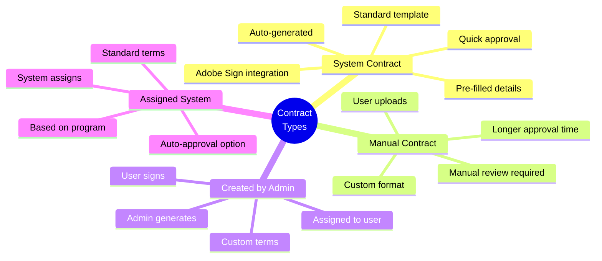
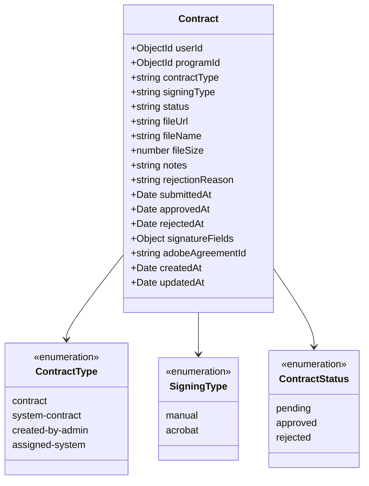
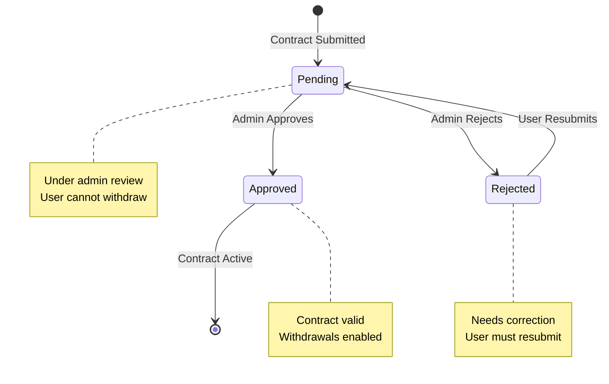
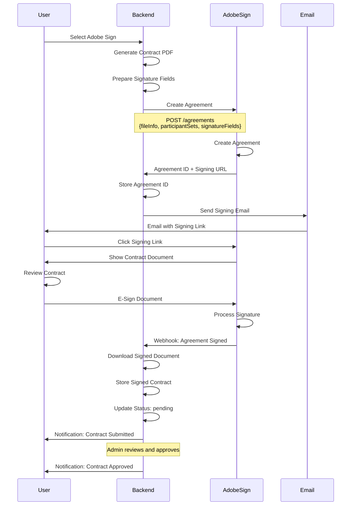
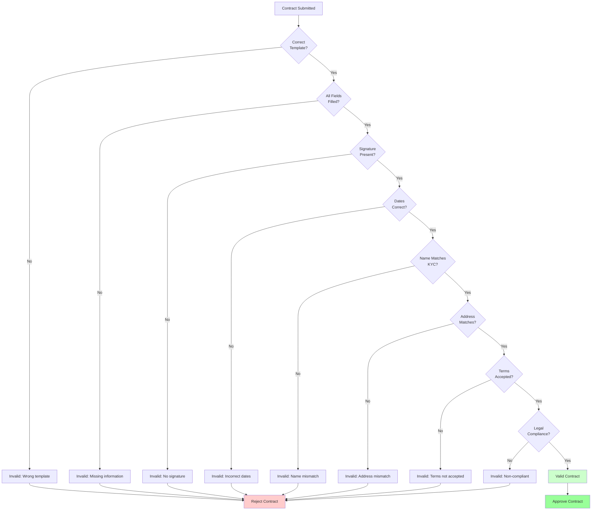
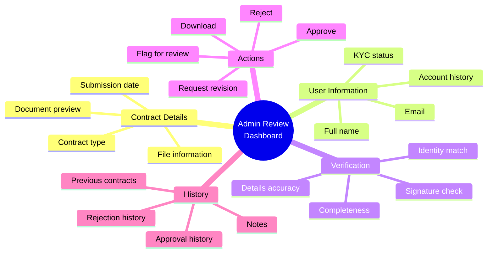
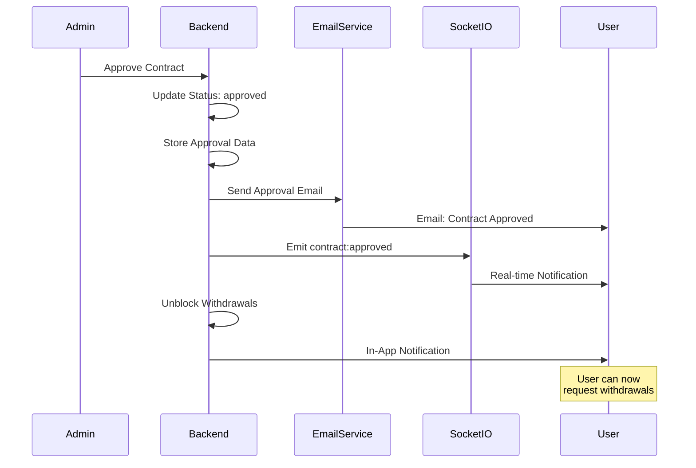
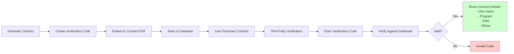
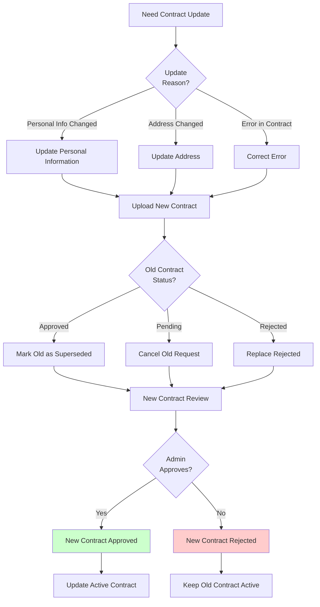

# Contract Submission Flow

## Complete Contract Upload and Signing Process

```mermaid
flowchart TD
    Start([Funded Account]) --> CheckRequired{Contract<br/>Required?}

    CheckRequired -->|No| NoContract[No Contract Needed:<br/>Proceed to withdrawals]
    CheckRequired -->|Yes| ContractNotif[Contract Requirement Notification]

    ContractNotif --> NotifChannels[Notification Channels:<br/>- Email reminder<br/>- In-app banner<br/>- Dashboard alert<br/>- Withdrawal blocked message]

    NotifChannels --> UserDashboard[User Goes to Dashboard]
    UserDashboard --> ContractSection[Navigate to Contract Section]

    ContractSection --> CheckExisting{Existing<br/>Contract?}

    CheckExisting -->|Yes| ViewStatus[View Contract Status]
    ViewStatus --> StatusCheck{Contract<br/>Status?}

    StatusCheck -->|Pending| WaitReview[Wait for Admin Review]
    StatusCheck -->|Approved| ContractApproved[Contract Approved:<br/>Can request withdrawals]
    StatusCheck -->|Rejected| ViewRejection[View Rejection Reason]

    ViewRejection --> ReuploadOption{Reupload?}
    ReuploadOption -->|Yes| UploadNew
    ReuploadOption -->|No| End1([End])

    CheckExisting -->|No| ContractType{Contract<br/>Type?}

    ContractType -->|System Contract| SystemContract[System-Generated Contract]
    ContractType -->|Manual Upload| ManualContract[Manual Contract Upload]

    SystemContract --> CheckTemplate{Template<br/>Available?}

    CheckTemplate -->|Yes| SelectTemplate[Select Contract Template]
    SelectTemplate --> TemplateInfo[Template Information:<br/>- Standard agreement<br/>- Profit split terms<br/>- Trading rules<br/>- Payout terms<br/>- Liability clauses]

    TemplateInfo --> FillDetails[Auto-fill User Details:<br/>- Full name<br/>- Email<br/>- Address<br/>- Program details<br/>- Account size<br/>- Profit split %]

    FillDetails --> ReviewTemplate[Review Contract Terms]
    ReviewTemplate --> AcceptTerms{Accept<br/>Terms?}

    AcceptTerms -->|No| DeclineContract[Decline Contract]
    DeclineContract --> CannotWithdraw[Cannot Request Withdrawals]
    CannotWithdraw --> End2([End])

    AcceptTerms -->|Yes| SigningMethod{Signing<br/>Method?}

    SigningMethod -->|Manual| ManualSign[Manual Signature]
    ManualSign --> UploadSigned[Upload Signed PDF]
    UploadSigned --> SubmitContract

    SigningMethod -->|Adobe Sign| AdobeSign[Adobe Sign Integration]
    AdobeSign --> SendToAdobe[Send to Adobe Sign]
    SendToAdobe --> AdobeProcess[Adobe Sign Process:<br/>1. Email sent to user<br/>2. User opens email<br/>3. Review document<br/>4. E-sign document<br/>5. Submit signature]

    AdobeProcess --> AdobeCallback[Adobe Sign Callback]
    AdobeCallback --> AdobeStatus{Signing<br/>Status?}

    AdobeStatus -->|Completed| DownloadSigned[Download Signed Document]
    AdobeStatus -->|Declined| SigningDeclined[User Declined Signing]
    AdobeStatus -->|Expired| SigningExpired[Signing Link Expired]

    SigningDeclined --> CannotWithdraw
    SigningExpired --> ResendSign{Resend?}
    ResendSign -->|Yes| SendToAdobe
    ResendSign -->|No| End2

    DownloadSigned --> StoreContract[Store Signed Contract]
    StoreContract --> SubmitContract

    CheckTemplate -->|No| ManualContract

    ManualContract --> UploadNew[Upload Contract Document]

    UploadNew --> FileUpload[File Upload Interface]
    FileUpload --> SelectFile[Select File from Device]

    SelectFile --> ValidateFile{File Valid?}

    ValidateFile -->|No| FileError[File Error:<br/>- Invalid format<br/>- File too large<br/>- Corrupted file<br/>- Wrong document type]
    FileError --> SelectFile

    ValidateFile -->|Yes| FileDetails[File Details:<br/>- File name<br/>- File size<br/>- Upload date<br/>- Document type]

    FileDetails --> AddNotes{Add Notes?}
    AddNotes -->|Yes| EnterNotes[Enter Notes/Comments]
    EnterNotes --> SubmitContract
    AddNotes -->|No| SubmitContract[Submit Contract]

    SubmitContract --> CreateRecord[Create Contract Record]

    CreateRecord --> RecordData[Contract Record:<br/>- User ID<br/>- Program ID<br/>- Contract type<br/>- File URL<br/>- Signing type<br/>- Status: pending<br/>- Notes<br/>- Submission date]

    RecordData --> NotifyUser[Notify User:<br/>- Email confirmation<br/>- In-app notification<br/>- Submission received<br/>- Review timeline]

    NotifyUser --> NotifyAdmin[Notify Admin:<br/>- New contract submitted<br/>- User details<br/>- Dashboard alert<br/>- Review queue]

    NotifyAdmin --> AdminQueue[Add to Admin Review Queue]

    AdminQueue --> AdminReview[Admin Reviews Contract]

    AdminReview --> AdminDashboard[Admin Dashboard Shows:<br/>- User profile<br/>- Contract document<br/>- Program details<br/>- Account history<br/>- Previous contracts<br/>- KYC status]

    AdminDashboard --> DownloadContract[Download Contract PDF]
    DownloadContract --> ReviewDocument[Review Document Content]

    ReviewDocument --> CheckValidity[Check Contract Validity:<br/>- Correct template used<br/>- All fields filled<br/>- Signature present<br/>- Dates correct<br/>- Terms accepted<br/>- Legal compliance]

    CheckValidity --> VerifyIdentity[Verify Identity:<br/>- Name matches KYC<br/>- Signature matches<br/>- Address matches<br/>- Details consistent]

    VerifyIdentity --> CheckCompleteness{Document<br/>Complete?}

    CheckCompleteness -->|No| RequestRevision[Request Revision]
    RequestRevision --> RevisionReason[Provide Revision Reason:<br/>- Missing information<br/>- Incorrect details<br/>- Invalid signature<br/>- Wrong template<br/>- Other issues]

    RevisionReason --> RejectContract[Reject Contract]

    CheckCompleteness -->|Yes| CheckLegitimacy{Legitimate<br/>Document?}

    CheckLegitimacy -->|No| FraudDetected[Fraud Detected:<br/>- Forged signature<br/>- Fake document<br/>- Identity mismatch<br/>- Suspicious activity]

    FraudDetected --> FlagAccount[Flag Account for Investigation]
    FlagAccount --> RejectContract

    CheckLegitimacy -->|Yes| AutoApprove{Auto-Approve<br/>Enabled?}

    AutoApprove -->|Yes| ApproveContract[Approve Contract]
    AutoApprove -->|No| ManualDecision{Admin<br/>Decision?}

    ManualDecision -->|Reject| RejectContract
    ManualDecision -->|Approve| ApproveContract

    ApproveContract --> UpdateStatus[Update Status: approved]
    UpdateStatus --> StoreApproved[Store Approved Contract]

    StoreApproved --> NotifyApproval[Notify User:<br/>- Email: Contract approved<br/>- In-app notification<br/>- Can now request withdrawals<br/>- View approved contract]

    NotifyApproval --> SocketUpdate[Socket.io Update:<br/>- Event: contract:approved<br/>- Dashboard refresh<br/>- Enable withdrawal button]

    SocketUpdate --> UnblockWithdrawals[Unblock Withdrawal Requests]
    UnblockWithdrawals --> ContractComplete[Contract Process Complete]

    ContractComplete --> EnableWithdrawals[User Can Now:<br/>- Request withdrawals<br/>- View contract<br/>- Download contract<br/>- Update contract if needed]

    EnableWithdrawals --> End3([End - Contract Approved])

    RejectContract --> UpdateStatusRejected[Update Status: rejected]
    UpdateStatusRejected --> NotifyRejection[Notify User:<br/>- Email: Contract rejected<br/>- Rejection reason<br/>- Required corrections<br/>- Resubmission instructions]

    NotifyRejection --> UserResubmit{User<br/>Resubmits?}

    UserResubmit -->|Yes| UploadNew
    UserResubmit -->|No| End4([End - Cannot Withdraw])

    WaitReview --> CheckReviewTime{Review<br/>Time Exceeded?}
    CheckReviewTime -->|Yes| SendReminder[Send Reminder to Admin]
    SendReminder --> WaitReview
    CheckReviewTime -->|No| WaitReview

    NoContract --> End5([End - No Contract Needed])

    style ApproveContract fill:#ccffcc
    style ContractComplete fill:#99ff99
    style RejectContract fill:#ffcccc
    style FraudDetected fill:#ff9999
    style End3 fill:#e1f5e1
    style End4 fill:#ffe1e1
    style End5 fill:#e1f5e1
```

## Contract Types

## Contract Data Structure

## Contract Status Flow

## Adobe Sign Integration Flow

## Contract Validation Checklist

## Contract Requirements by Program

| Program Type | Contract Required | Signing Method | Auto-Approve | Review Time |
|--------------|-------------------|----------------|--------------|-------------|
| **Challenge Phase 1** | No | N/A | N/A | N/A |
| **Challenge Phase 2** | No | N/A | N/A | N/A |
| **Challenge Phase 3** | No | N/A | N/A | N/A |
| **Funded Account** | Yes | Manual or Adobe | Optional | 1-3 days |
| **Instant Funded** | Yes | Manual or Adobe | Optional | 1-3 days |

## Contract Document Sections

Typical contract includes:

1. **Parties**
   - Company information
   - User information
   - Effective date

2. **Account Details**
   - Program name
   - Account size
   - Account number
   - Start date

3. **Trading Terms**
   - Trading rules
   - Drawdown limits
   - Prohibited strategies
   - Risk management

4. **Profit Split**
   - Profit split percentage
   - Platform fee
   - Payment terms
   - Withdrawal schedule

5. **Payout Terms**
   - Minimum withdrawal
   - Holding period
   - Payment methods
   - Processing time

6. **Liability**
   - Risk disclosure
   - Liability limitations
   - Indemnification
   - Dispute resolution

7. **Termination**
   - Termination conditions
   - Breach consequences
   - Account closure
   - Final settlement

8. **Signatures**
   - User signature
   - Date
   - Company signature
   - Witness (if required)

## File Upload Specifications

| Specification | Requirement |
|---------------|-------------|
| **File Format** | PDF only |
| **Max File Size** | 10 MB |
| **Min File Size** | 10 KB |
| **Resolution** | Readable quality |
| **Pages** | 1-20 pages |
| **Encryption** | Not encrypted |
| **Password** | No password |

## Admin Review Dashboard

## Contract Rejection Reasons

Common rejection reasons:

1. **Missing Information**
   - Incomplete fields
   - Missing signature
   - No date
   - Missing address

2. **Incorrect Details**
   - Name mismatch
   - Wrong account number
   - Incorrect dates
   - Wrong program details

3. **Invalid Signature**
   - No signature
   - Illegible signature
   - Digital signature invalid
   - Signature doesn't match

4. **Wrong Template**
   - Old version used
   - Wrong program template
   - Custom template not accepted
   - Missing required clauses

5. **Quality Issues**
   - Poor scan quality
   - Unreadable text
   - Corrupted file
   - Wrong file format

6. **Fraud Concerns**
   - Forged signature
   - Fake document
   - Identity theft suspected
   - Suspicious activity

## Contract Approval Notifications

## Contract Verification Code

Some contracts include verification codes for authenticity:

## Auto-Approve Feature

When enabled, contracts are automatically approved if:

1. **System-Generated Contract**
   - Using standard template
   - Auto-filled details
   - Adobe Sign used

2. **User Verified**
   - KYC completed
   - Identity verified
   - No fraud flags

3. **Account Good Standing**
   - No breaches
   - No violations
   - Clean history

4. **Signature Valid**
   - E-signature captured
   - Adobe Sign confirmed
   - Timestamp recorded

## Contract Update Process

If user needs to update contract:

---

**API Endpoints**:
- `GET /api/contracts/eligibility` - Check if contract required
- `POST /api/contracts` - Submit contract
- `GET /api/contracts/my-contracts` - Get user's contracts
- `GET /api/contracts/:id` - Get contract details
- `GET /api/contracts/:id/download` - Download contract PDF
- `POST /api/contracts/:id/resubmit` - Resubmit rejected contract
- `GET /api/admin/contracts` - List all contracts (admin)
- `POST /api/admin/contracts/:id/approve` - Approve contract (admin)
- `POST /api/admin/contracts/:id/reject` - Reject contract (admin)
- `GET /api/contracts/verify/:code` - Verify contract code
- `POST /api/contracts/adobe-sign` - Create Adobe Sign agreement
- `POST /api/contracts/adobe-webhook` - Adobe Sign webhook

**Socket.io Events**:
- `contract:submitted` - Contract submitted
- `contract:approved` - Contract approved
- `contract:rejected` - Contract rejected
- `withdrawals:unblocked` - Withdrawals enabled

**Files**:
- `pft-backend/src/app/modules/Contracts/contract.routes.ts`
- `pft-backend/src/app/modules/Contracts/contract.service.ts`
- `pft-backend/src/app/modules/Contracts/services/adobe-sign.service.ts`
- `pft-dashboard/src/app/(dashboard)/_components/modules/users/contracts`
