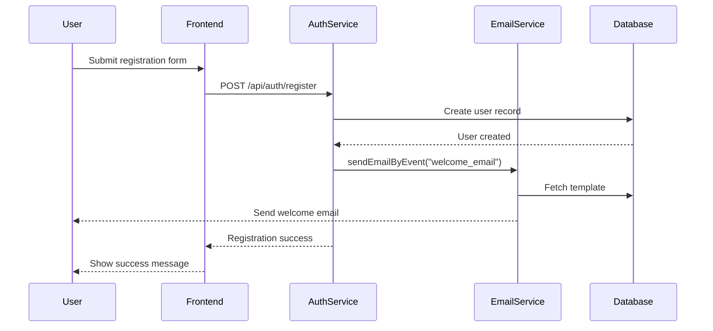
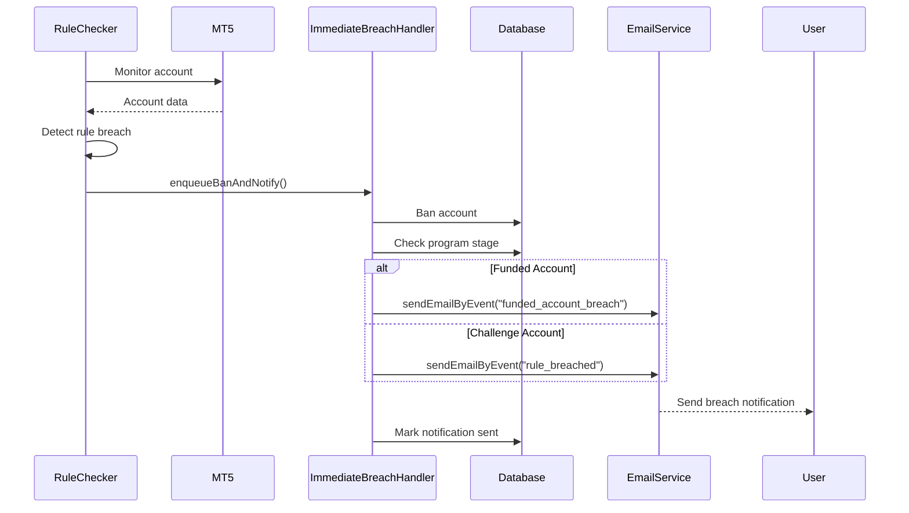
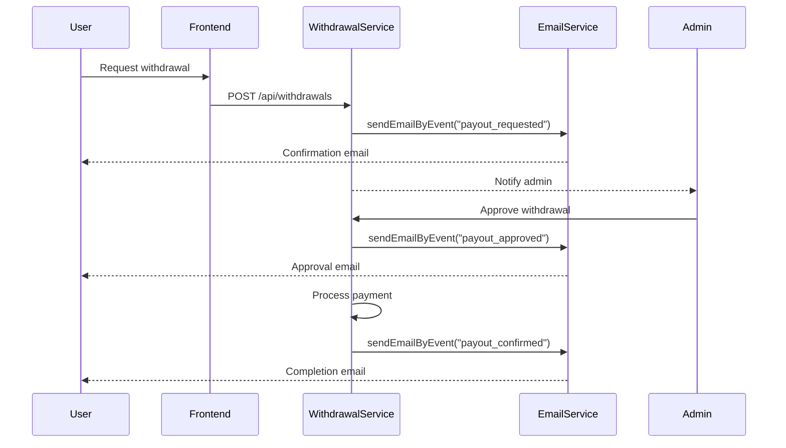
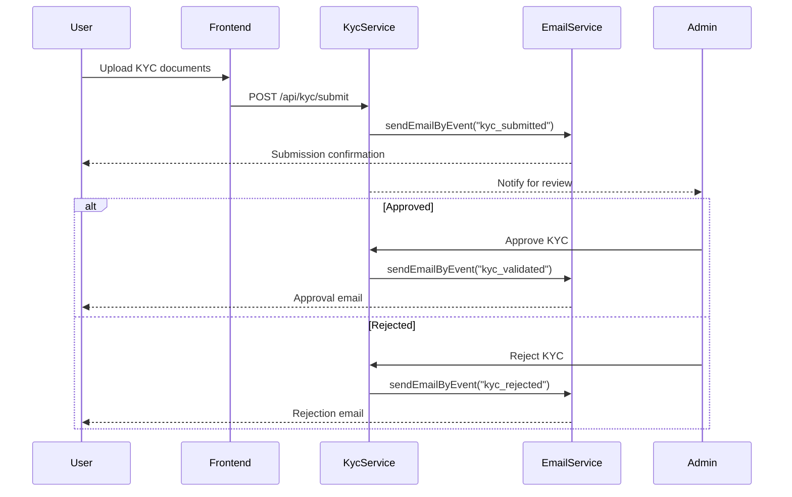

# Email Flows - Technical Documentation

## Overview

The PFT WhiteLabel v2 platform uses a centralized email service (`sendEmailByEvent`) that sends emails based on event names. Email templates are stored in the database and support variable substitution.

### Email Infrastructure

**Backend Service**: `/pft-backend/src/app/services/email/sendEmail.service.ts`
**Rule-Checker Service**: `/pft-rule-checker/src/app/services/email/sendEmail.service.ts`

Both services provide:
- `sendEmailByEvent(eventName, recipientEmail, variables)` - Main function for sending emails
- Template lookup from database (`message_templates` collection)
- Multiple provider support (Postmark, SendGrid, Zoho, SMTP)
- Email logging and retry logic
- Trustpilot BCC integration for positive events

---

## Complete Email Event Catalog

### 1. Authentication & User Management

#### welcome_email
**Trigger Location**: `/pft-backend/src/app/modules/Auth/auth.service.ts:558, 938`
**Trigger Condition**: After successful user registration
**Variables**:
```typescript
{
  user_name: string  // User's first name
}
```
**Code Snippet**:
```typescript
await sendEmailByEvent("welcome_email", email, {
  user_name: payload.firstName || "User",
});
```

#### two_factor_auth
**Trigger Location**: `/pft-backend/src/app/modules/Auth/auth.service.ts:1119, 1161`
**Trigger Condition**: When 2FA is required for login (new IP/device or 2FA enabled)
**Variables**:
```typescript
{
  otp: string,           // 6-digit OTP code
  user_name: string      // User's first name
}
```

#### reset_password
**Trigger Location**: `/pft-backend/src/app/modules/Auth/auth.service.ts:1312`
**Trigger Condition**: When user requests password reset
**Variables**:
```typescript
{
  reset_link: string,    // Password reset URL with token
  user_name: string      // User's first name
}
```

#### admin_created_user
**Trigger Location**: `/pft-backend/src/app/modules/Auth/auth.service.ts:1378`
**Trigger Condition**: When admin creates a new user account
**Variables**:
```typescript
{
  user_name: string,
  user_email: string,
  temporary_password: string,
  login_url: string
}
```

#### password_set_success
**Trigger Location**: `/pft-backend/src/app/modules/Auth/auth.service.ts:1388`
**Trigger Condition**: After user successfully sets/resets password
**Variables**:
```typescript
{
  user_name: string
}
```

---

### 2. Trading Account Management

#### new_trading_account
**Trigger Location**: `/pft-backend/src/app/modules/Payment/services/program.service.ts:433`
**Trigger Condition**: When new trading account is assigned to user (after purchase or admin assignment)
**Variables**:
```typescript
{
  user_name: string,
  program_name: string,
  challenge_type: string,
  program_stage: string,
  account_size: string,
  mt5_id: string,
  rules: string,
  mt5_pass: string,
  broker_server: string,
  site_name: string,
  login_url: string
}
```
**Code Snippet**:
```typescript
await sendEmailByEvent("new_trading_account", user?.email, {
  user_name: user?.firstName,
  program_name: programDisplayName,
  challenge_type: program.challengeType,
  program_stage: program?.programStage,
  account_size: program.accountSize,
  mt5_id: mt5LoginId,
  rules: rules,
  mt5_pass: mt5AccountPass,
  broker_server: brokerServer,
  site_name: siteName,
  login_url: dashboardUrl,
});
```

---

### 3. Challenge & Progression

#### challenge_passed
**Trigger Location**: `/pft-rule-checker/src/app/services/ban/violationActions.service.ts:401`
**Trigger Condition**: When user passes challenge requirements
**Variables**:
```typescript
{
  user_name: string,
  account_id: string,
  program_name: string,
  final_balance: string,
  profit_amount: string,
  trading_days: string
}
```

#### challenge_not_passed
**Trigger Location**: `/pft-rule-checker/src/app/services/ban/violationActions.service.ts:266`
**Trigger Condition**: When challenge account breaches trading rules
**Variables**:
```typescript
{
  user_name: string,
  account_id: string,
  program_name: string,
  challenge_name: string,
  message: string,
  ban_reason: string,
  violation_details: string,
  dash_link: string,
  dashboard_url: string,
  breach_type: string,
  breach_date: string,
  current_equity: string,
  current_balance: string,
  floating_pnl: string,
  breach_level: string
}
```

#### program_progression
**Trigger Location**: Multiple files in `/pft-rule-checker/src/app/`:
- `controllers/sdkIntegration.controller.ts:385`
- `controllers/sdkProgressionNotification.controller.ts:244`
- `controllers/programProgression.controller.ts:469`
- `services/rule-engine/utils/programProgression.ts:91`

**Trigger Condition**: When user progresses to next program phase
**Variables**:
```typescript
{
  user_name: string,
  program_name: string,
  previous_program: string,
  program_stage: string,
  challenge_type: string,
  account_size: string,
  mt5_id: string,
  mt5_pass: string,
  broker_server: string,
  rules: string
}
```

---

### 4. Rule Breaches

#### rule_breached
**Trigger Location**: `/pft-rule-checker/src/app/services/ban/ImmediateBreachHandler.ts:1473`
**Trigger Condition**: When trading rule is breached (challenge accounts)
**Variables**:
```typescript
{
  user_name: string,
  account_id: string,
  program_name: string,
  violation_details: string,
  check_date: string,
  company_name: string,
  breach_type: string,
  breach_type_label: string,
  rule_name: string,
  breach_date: string,
  current_equity: string,
  current_balance: string,
  floating_pnl: string,
  breach_level: string,
  baseline_at_breach: string,
  breach_value: string,
  breach_limit: string,
  dashboard_url: string
}
```

#### funded_account_breach
**Trigger Location**:
- `/pft-rule-checker/src/app/services/ban/ImmediateBreachHandler.ts:1473`
- `/pft-rule-checker/src/app/services/ban/violationActions.service.ts:266`

**Trigger Condition**: When funded account breaches trading rules
**Variables**: Same as `rule_breached` plus:
```typescript
{
  account_type: "Funded Account",
  program_stage: "funded"
}
```

---

### 5. Withdrawals & Payouts

#### payout_requested
**Trigger Location**: `/pft-backend/src/app/modules/Withdrawals/withdrawal.service.ts:859`
**Trigger Condition**: When user submits withdrawal request
**Variables**:
```typescript
{
  user_name: string,
  withdrawal_amount: string,
  requested_amount: string,
  platform_fee: string,
  total_deduction: string,
  withdrawal_date: string
}
```

#### payout_approved
**Trigger Location**: `/pft-backend/src/app/modules/Withdrawals/services/withdrawal-notification.service.ts:30`
**Trigger Condition**: When admin approves withdrawal
**Variables**:
```typescript
{
  user_name: string,
  transaction_id: string,
  transaction_amount: string,
  transaction_amount_usd: string,
  actual_paid_amount: string,
  requested_amount: string,
  currency: "USD",
  wallet_address: string,
  network: string,
  transaction_date: string
}
```

#### payout_confirmed
**Trigger Location**: `/pft-backend/src/app/modules/Withdrawals/services/withdrawal-notification.service.ts:64`
**Trigger Condition**: When withdrawal is completed/confirmed
**Variables**:
```typescript
{
  user_name: string,
  transaction_id: string,
  transaction_amount: string,
  actual_paid_amount: string,
  requested_amount: string,
  currency: "USD",
  wallet_address: string,
  network: string,
  fee: string,
  transaction_date: string
}
```

#### payout_rejected
**Trigger Location**: `/pft-backend/src/app/modules/Withdrawals/withdrawal.service.ts:1912`
**Trigger Condition**: When admin rejects withdrawal
**Variables**:
```typescript
{
  user_name: string,
  withdrawal_amount: string,
  rejection_reason: string,
  withdrawal_date: string,
  rejection_date: string
}
```

---

### 6. KYC Verification

#### kyc_submitted
**Trigger Location**: `/pft-backend/src/app/modules/Kyc/kyc.service.ts:267`
**Trigger Condition**: When user submits KYC documents
**Variables**:
```typescript
{
  user_name: string,
  submission_date: string
}
```

#### kyc_validated
**Trigger Location**: `/pft-backend/src/app/modules/Kyc/kyc.service.ts:559`
**Trigger Condition**: When admin approves KYC
**Variables**:
```typescript
{
  user_name: string,
  approval_date: string
}
```

#### kyc_rejected
**Trigger Location**: `/pft-backend/src/app/modules/Kyc/kyc.service.ts:566`
**Trigger Condition**: When admin rejects KYC
**Variables**:
```typescript
{
  user_name: string,
  rejection_reason: string,
  rejection_date: string
}
```

---

### 7. Contracts

#### contract_approved
**Trigger Location**: `/pft-backend/src/app/modules/Contracts/contracts.service.ts:277, 906`
**Trigger Condition**: When admin approves contract
**Variables**:
```typescript
{
  user_name: string,
  contract_type: string,
  approval_date: string
}
```

#### contract_rejected
**Trigger Location**: `/pft-backend/src/app/modules/Contracts/contracts.service.ts:463`
**Trigger Condition**: When admin rejects contract
**Variables**:
```typescript
{
  user_name: string,
  contract_type: string,
  rejection_reason: string,
  rejection_date: string
}
```

#### contract_pending
**Trigger Location**: `/pft-backend/src/app/modules/Contracts/contracts.service.ts:454`
**Trigger Condition**: When contract status changes to pending
**Variables**:
```typescript
{
  user_name: string,
  contract_type: string
}
```

---

### 8. Affiliate System

#### referral_registration
**Trigger Location**: `/pft-backend/src/app/modules/Auth/auth.service.ts:1976`
**Trigger Condition**: When someone registers using referral code
**Variables**:
```typescript
{
  referrer_name: string,
  new_user_name: string,
  new_user_email: string,
  referral_code: string,
  registration_date: string
}
```

#### commission_earned
**Trigger Location**: `/pft-backend/src/app/modules/Affiliate/affiliate.service.ts:2902`
**Trigger Condition**: When affiliate earns commission from referral purchase
**Variables**:
```typescript
{
  referrer_name: string,
  commission_amount: string,
  buyer_name: string,
  program_name: string,
  purchase_date: string
}
```

#### withdrawal_approved
**Trigger Location**: `/pft-backend/src/app/modules/Affiliate/affiliate.service.ts:890`
**Trigger Condition**: When affiliate withdrawal is approved
**Variables**:
```typescript
{
  user_name: string,
  amount: string,
  method: string,
  withdrawal_date: string
}
```

#### withdrawal_rejected
**Trigger Location**: `/pft-backend/src/app/modules/Affiliate/affiliate.service.ts:895`
**Trigger Condition**: When affiliate withdrawal is rejected
**Variables**:
```typescript
{
  user_name: string,
  amount: string,
  reason: string,
  withdrawal_date: string
}
```

#### withdrawal_completed
**Trigger Location**: `/pft-backend/src/app/modules/Affiliate/affiliate.service.ts:903`
**Trigger Condition**: When affiliate withdrawal is completed
**Variables**:
```typescript
{
  user_name: string,
  amount: string,
  method: string,
  completion_date: string
}
```

---

### 9. Inactivity Policy

#### inactivity_warning
**Trigger Location**: `/pft-backend/src/app/modules/Admin/InactivityPolicy/inactivity-cron.service.ts:281`
**Trigger Condition**: When account reaches warning threshold (e.g., 15 days inactive)
**Variables**:
```typescript
{
  user_name: string,
  user_email: string,
  account_id: string,
  program_id: string,
  program_name: string,
  program_created_at: string,
  warning_days: string,
  breach_days: string,
  warning_date: string,
  breach_date: string,
  days_inactive: string,
  policy_description: string,
  site_name: string,
  dashboard_url: string
}
```

#### inactivity_breach
**Trigger Location**: `/pft-backend/src/app/modules/Admin/InactivityPolicy/inactivity-cron.service.ts:369`
**Trigger Condition**: When account reaches breach threshold (e.g., 30 days inactive)
**Variables**: Same as `inactivity_warning`

---

### 10. Payment & Certificates

#### success_payment
**Trigger Location**: `/pft-backend/src/app/modules/Payment/services/stripe-webhook.service.ts:428`
**Trigger Condition**: After successful Stripe payment
**Variables**:
```typescript
{
  user_name: string,
  amount: string,
  currency: string,
  payment_date: string,
  program_name: string
}
```

#### user_certificate
**Trigger Location**: `/pft-backend/src/app/modules/Certificates/certificate.service.ts:549`
**Trigger Condition**: When certificate is generated for user
**Variables**:
```typescript
{
  user_name: string,
  certificate_url: string,
  program_name: string,
  issue_date: string
}
```

---

## Email Flow Diagrams

### User Registration Flow



### Challenge Breach Flow



### Withdrawal Flow



### KYC Verification Flow



---

## API Endpoints That Trigger Emails

| Endpoint | Method | Email Event | Service File |
|----------|--------|-------------|--------------|
| `/api/auth/register` | POST | welcome_email | auth.service.ts |
| `/api/auth/login` | POST | two_factor_auth | auth.service.ts |
| `/api/auth/forgot-password` | POST | reset_password | auth.service.ts |
| `/api/admin/users` | POST | admin_created_user | auth.service.ts |
| `/api/programs/assign` | POST | new_trading_account | program.service.ts |
| `/api/withdrawals` | POST | payout_requested | withdrawal.service.ts |
| `/api/withdrawals/:id` | PATCH | payout_approved, payout_rejected | withdrawal.service.ts |
| `/api/kyc/submit` | POST | kyc_submitted | kyc.service.ts |
| `/api/kyc/:id/approve` | PATCH | kyc_validated | kyc.service.ts |
| `/api/kyc/:id/reject` | PATCH | kyc_rejected | kyc.service.ts |
| `/api/contracts/:id/approve` | PATCH | contract_approved | contracts.service.ts |
| `/api/contracts/:id/reject` | PATCH | contract_rejected | contracts.service.ts |
| `/api/payments/webhook` | POST | success_payment | stripe-webhook.service.ts |

---

## Database Models Involved

### message_templates Collection
Stores email templates with variables:
```typescript
{
  event: string,           // Email event name
  subject: string,         // Email subject with {{variables}}
  body: string,           // HTML body with {{variables}}
  isActive: boolean,
  provider: string,       // Email provider
  createdAt: Date,
  updatedAt: Date
}
```

### email_logs Collection
Tracks all sent emails:
```typescript
{
  event: string,
  recipient: string,
  status: "pending" | "sent" | "failed",
  variables: object,
  provider: string,
  error: string,
  sentAt: Date,
  createdAt: Date
}
```

### User Model
Stores email notification flags:
```typescript
{
  programs: [{
    banNotifiedAt: Date,
    passedNotifiedAt: Date,
    progressionNotifiedAt: Date,
    inactivityWarningSent: boolean,
    inactivityWarningSentAt: Date,
    inactivityBreachProcessed: boolean
  }]
}
```

---

## Email Provider Configuration

The system supports multiple email providers configured via Super-Admin settings:

1. **Postmark** (Primary)
2. **SendGrid**
3. **Zoho**
4. **SMTP** (Generic)

Provider selection is automatic based on configuration priority.

---

## Trustpilot Integration

Positive email events automatically BCC Trustpilot for review invitations:

**Positive Events**:
- payout_approved
- challenge_passed
- funded_achieved
- funded_validation
- program_progression

**Configuration**: `/pft-backend/src/app/modules/Trustpilot/trustpilot.validation.ts`

---

## Email Queue System (Rule-Checker)

The rule-checker uses a priority-based email queue:

**Priority Levels**:
1. BREACH (Highest) - rule_breached, funded_account_breach
2. PROGRESSION - program_progression
3. NORMAL - Other emails

**Queue Service**: `/pft-rule-checker/src/app/services/queue/emailQueue.ts`

---

## Notes on Missing/Unused Events

The following events are defined in the service but not actively triggered:

- **funded_achieved** - Mentioned in Trustpilot config but no trigger found
- **funded_validation** - Mentioned in Trustpilot config but no trigger found
- **kyc_requested** - Not implemented
- **kyc_pending** - Not implemented
- **contract_uploaded** - Not implemented

These may be legacy events or planned for future implementation.
