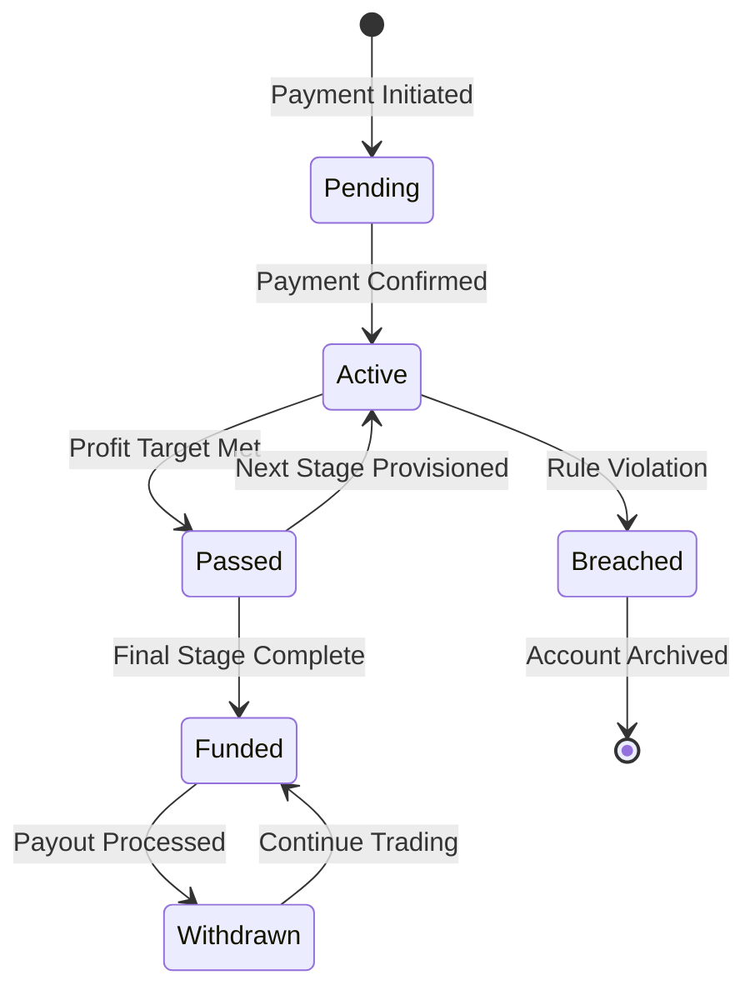

# Master User Flow

## Complete User Journey Overview

```mermaid
flowchart TD
    Start([New User]) --> Register[Register Account]
    Register --> VerifyOTP[Verify OTP]
    VerifyOTP --> Login[Login with 2FA]
    Login --> Browse[Browse Programs]

    Browse --> SelectProgram[Select Challenge Program]
    SelectProgram --> SelectAddons[Select Addons/Bundles]
    SelectAddons --> ApplyCoupon[Apply Coupon/Referral Code]
    ApplyCoupon --> ChoosePayment{Choose Payment Option}

    ChoosePayment -->|Full Payment| PayFull[Pay Full Price]
    ChoosePayment -->|Pay After Pass| PayPartial[Pay Initial Price]

    PayFull --> SelectGateway[Select Payment Gateway]
    PayPartial --> SelectGateway

    SelectGateway --> ProcessPayment[Process Payment]
    ProcessPayment --> PaymentSuccess{Payment Success?}

    PaymentSuccess -->|No| PaymentFailed[Payment Failed]
    PaymentFailed --> Browse

    PaymentSuccess -->|Yes| ProvisionMT5[Provision MT5 Account]
    ProvisionMT5 --> ReceiveCredentials[Receive MT5 Credentials]
    ReceiveCredentials --> ConnectMT5[Connect to MT5]

    ConnectMT5 --> StartTrading[Start Trading]
    StartTrading --> RealTimeMonitor[Real-Time Trade Monitoring]

    RealTimeMonitor --> CheckRules{Rule Engine Check}

    CheckRules -->|Breach Detected| BreachProcess[Breach Process]
    BreachProcess --> AccountBanned[Account Banned/Archived]
    AccountBanned --> BuyNewAccount{Buy New Account?}
    BuyNewAccount -->|Yes| Browse
    BuyNewAccount -->|No| End1([End])

    CheckRules -->|Profit Target Met| PassCheck{Pass Eligibility?}
    PassCheck -->|Not Eligible| ContinueTrading[Continue Trading]
    ContinueTrading --> RealTimeMonitor

    PassCheck -->|Eligible| PassProcess[Pass Process]
    PassProcess --> GenerateCert[Generate Certificate]
    GenerateCert --> NextStage{Has Next Stage?}

    NextStage -->|Yes - Phase 2/3| ProvisionNext[Provision Next Stage Account]
    ProvisionNext --> PayAfterPassCheck{Pay After Pass?}
    PayAfterPassCheck -->|Yes| PayRemaining[Pay Remaining Amount]
    PayAfterPassCheck -->|No| ConnectMT5
    PayRemaining --> ConnectMT5

    NextStage -->|Yes - Funded| FundedAccount[Funded Account]
    FundedAccount --> PayAfterPassCheck2{Pay After Pass?}
    PayAfterPassCheck2 -->|Yes| PayRemaining2[Pay Remaining Amount]
    PayAfterPassCheck2 -->|No| TradeFunded[Trade Funded Account]
    PayRemaining2 --> TradeFunded

    TradeFunded --> FundedMonitor[Real-Time Monitoring]
    FundedMonitor --> FundedRules{Rule Check}

    FundedRules -->|Breach| BreachProcess
    FundedRules -->|Trading Days Met| WithdrawalEligible{Withdrawal Eligible?}

    WithdrawalEligible -->|No| TradeFunded
    WithdrawalEligible -->|Yes| RequestWithdrawal[Request Withdrawal]

    RequestWithdrawal --> SubmitContract{Contract Required?}
    SubmitContract -->|Yes| UploadContract[Upload Contract]
    UploadContract --> ContractReview[Admin Reviews Contract]
    ContractReview --> ContractApproved{Approved?}
    ContractApproved -->|No| UploadContract
    ContractApproved -->|Yes| WithdrawalReview

    SubmitContract -->|No| WithdrawalReview[Admin Reviews Withdrawal]
    WithdrawalReview --> WithdrawalApproved{Approved?}

    WithdrawalApproved -->|No| WithdrawalRejected[Withdrawal Rejected]
    WithdrawalRejected --> TradeFunded

    WithdrawalApproved -->|Yes| ProcessPayout[Process Payout]
    ProcessPayout --> PayoutMethod{Payout Method}

    PayoutMethod -->|Rise Crypto| AutoPayout[Automated Crypto Payout]
    PayoutMethod -->|Manual| ManualPayout[Manual Bank Transfer]

    AutoPayout --> PayoutComplete[Payout Completed]
    ManualPayout --> PayoutComplete

    PayoutComplete --> DeductMT5[Deduct from MT5 Balance]
    DeductMT5 --> ResetHolding[Reset Holding Period]
    ResetHolding --> TradeFunded

    NextStage -->|No| End2([End - Challenge Complete])

    style Start fill:#e1f5e1
    style End1 fill:#ffe1e1
    style End2 fill:#e1f5e1
    style BreachProcess fill:#ffcccc
    style PassProcess fill:#ccffcc
    style PayoutComplete fill:#ccffcc
    style AccountBanned fill:#ff9999
```

## Key Decision Points

### 1. Payment Options
- **Full Payment**: Pay entire program cost upfront
- **Pay After Pass**: Pay 20-30% initially, remainder after passing each stage

### 2. Trading Outcomes
- **Breach**: Account banned, must purchase new account
- **Pass**: Progress to next stage or funded account
- **Withdrawal**: Available only on funded accounts after meeting requirements

### 3. Payout Methods
- **Rise Payout**: Automated cryptocurrency payments
- **Manual Payout**: Bank transfers processed by admin

## Account Types by Stage

| Stage | Account Type | Purpose |
|-------|-------------|---------|
| Phase 1 | Challenge | Meet profit target, avoid breaches |
| Phase 2 | Challenge | Meet profit target, avoid breaches |
| Phase 3 | Challenge | Meet profit target, avoid breaches |
| Funded | Live Trading | Trade for profit splits, request withdrawals |

## Status Transitions

## Real-Time Monitoring Tiers

| Tier | Condition | Check Frequency |
|------|-----------|-----------------|
| CRITICAL | 70%+ of limit used | 500ms (2x/second) |
| AT_RISK | 50%+ of limit used | 1 second |
| HIGH | Has open positions | 2 seconds |
| NORMAL | Recent activity | 5 seconds |
| IDLE | No recent trades | 15 seconds |
| DORMANT | Very inactive | 60 seconds |

---

**Generated**: 2026-02-08
**System**: PFT WhiteLabel v2 Dashboard
**Components**: pft-backend, pft-dashboard, pft-rule-checker, mt5-rest-api
