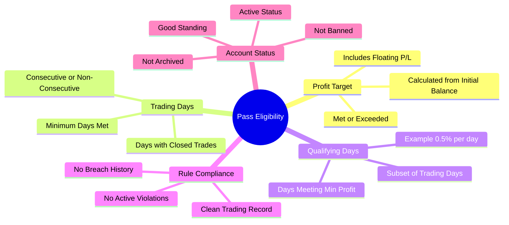
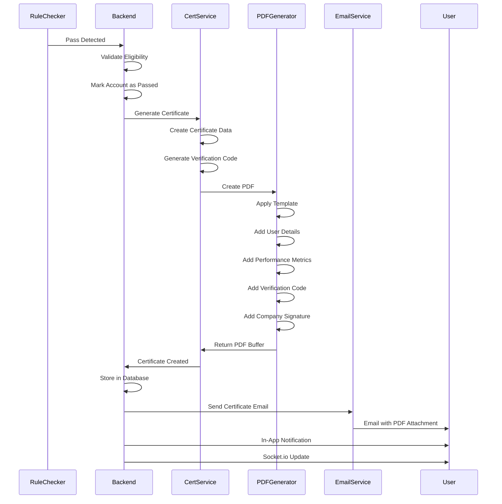
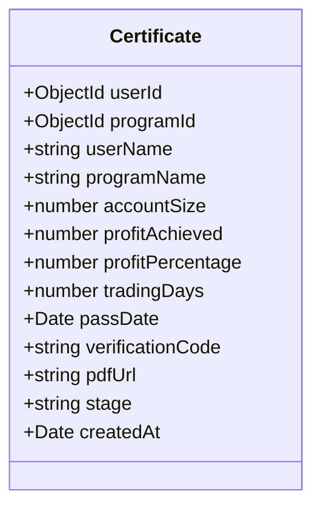
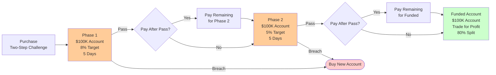
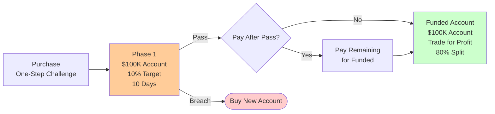
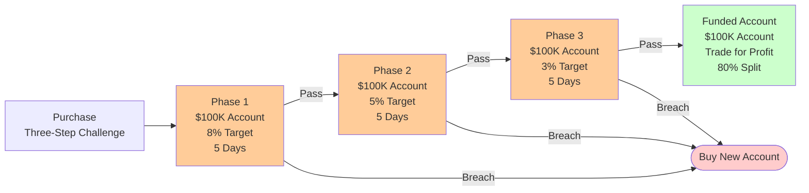
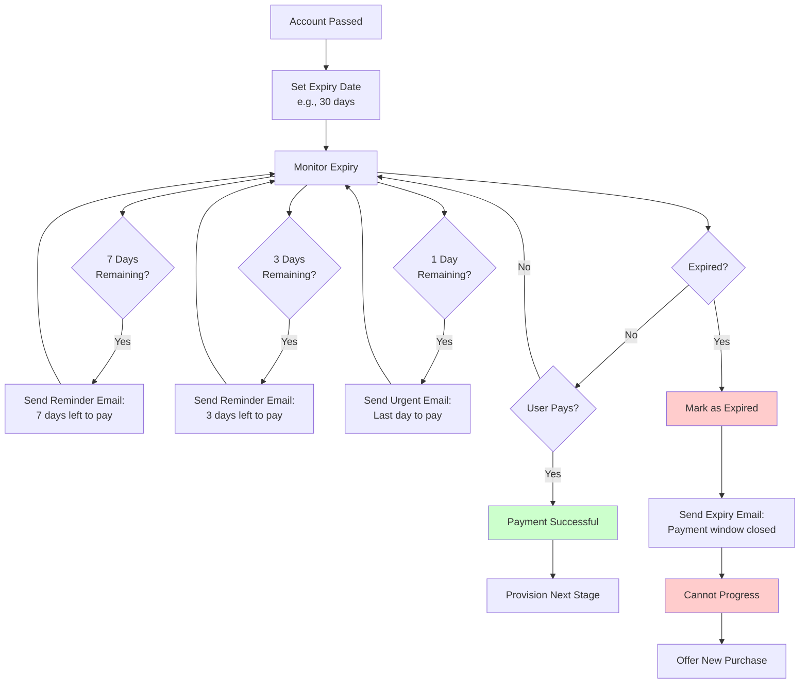
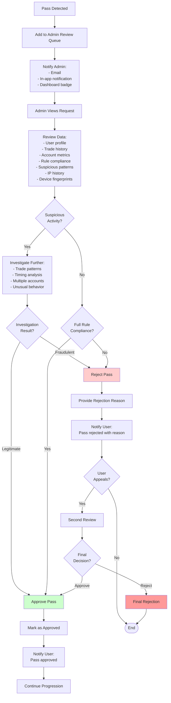
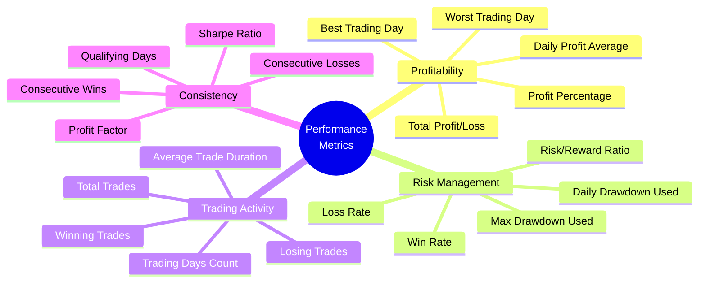

# Pass & Progression Flow

## Complete Pass Detection and Account Progression Process

```mermaid
flowchart TD
    Start([Rule Checker Monitoring]) --> CheckProfit[Check Profit Target]

    CheckProfit --> CalcProfit[Calculate Profit %:<br/>Current Equity - Initial Balance<br/>÷ Initial Balance × 100]

    CalcProfit --> ProfitMet{Profit Target<br/>Reached?}

    ProfitMet -->|No| ContinueMonitor[Continue Monitoring]
    ContinueMonitor --> Start

    ProfitMet -->|Yes| CheckTradingDays{Min Trading<br/>Days Met?}

    CheckTradingDays -->|No| WaitDays[Wait for More<br/>Trading Days]
    WaitDays --> ShowProgress[Show Progress:<br/>X/Y days completed]
    ShowProgress --> ContinueMonitor

    CheckTradingDays -->|Yes| CheckQualifying{Qualifying<br/>Days Met?}

    CheckQualifying -->|No| WaitQualifying[Need More<br/>Qualifying Days]
    WaitQualifying --> QualifyingInfo[Qualifying Day:<br/>Must meet min profit<br/>requirement per day]
    QualifyingInfo --> ContinueMonitor

    CheckQualifying -->|Yes| CheckViolations{Any Rule<br/>Violations?}

    CheckViolations -->|Yes| NotEligible[Not Eligible to Pass]
    NotEligible --> FixViolations[Fix Violations First]
    FixViolations --> ContinueMonitor

    CheckViolations -->|No| CheckStatus{Account<br/>Status?}

    CheckStatus -->|Banned| CannotPass[Cannot Pass:<br/>Account Breached]
    CheckStatus -->|Inactive| CannotPass
    CheckStatus -->|Active| EligibleToPass[ELIGIBLE TO PASS]

    EligibleToPass --> ProgressionMode{Progression<br/>Mode?}

    ProgressionMode -->|Auto| AutoProgress[Automatic Progression]
    ProgressionMode -->|Manual| ManualReview[Admin Manual Review]

    ManualReview --> AdminDashboard[Admin Reviews:<br/>- Trade history<br/>- Account performance<br/>- Rule compliance<br/>- Suspicious activity]

    AdminDashboard --> AdminDecision{Admin<br/>Decision?}

    AdminDecision -->|Reject| RejectionReason[Provide Rejection Reason]
    RejectionReason --> NotifyReject[Notify User of Rejection]
    NotifyReject --> ContinueMonitor

    AdminDecision -->|Approve| AutoProgress

    AutoProgress --> MarkPassed[Mark Account as Passed]

    MarkPassed --> UpdateStatus[Update Account Status:<br/>- accountType: passed<br/>- isPassed: true<br/>- passedAt: timestamp<br/>- status: archived]

    UpdateStatus --> GenerateCert[Generate Certificate]

    GenerateCert --> CertDetails[Certificate Contains:<br/>- User name<br/>- Program name<br/>- Account size<br/>- Profit achieved<br/>- Trading days<br/>- Pass date<br/>- Verification code<br/>- Company signature]

    CertDetails --> StoreCert[Store Certificate in Database]
    StoreCert --> SendCertEmail[Email Certificate PDF]

    SendCertEmail --> SendCongrats[Send Congratulations Email:<br/>- Achievement details<br/>- Certificate attached<br/>- Next steps<br/>- Pay-after-pass reminder]

    SendCongrats --> InAppNotif[In-App Notification:<br/>- Congratulations message<br/>- View certificate<br/>- Next stage info]

    InAppNotif --> SocketUpdate[Socket.io Update:<br/>- Event: target:reached<br/>- Account passed<br/>- Dashboard refresh]

    SocketUpdate --> CheckNextStage{Has Next<br/>Stage?}

    CheckNextStage -->|No| FinalPass[Final Stage Passed]
    FinalPass --> Celebration[Show Completion:<br/>- Challenge complete<br/>- View certificate<br/>- Share achievement]
    Celebration --> End1([End - Challenge Complete])

    CheckNextStage -->|Yes| NextStageInfo[Get Next Stage Program]

    NextStageInfo --> StageType{Next Stage<br/>Type?}

    StageType -->|Phase 2| Phase2Info[Phase 2 Details:<br/>- Higher profit target<br/>- Different rules<br/>- Same or larger size]

    StageType -->|Phase 3| Phase3Info[Phase 3 Details:<br/>- Higher profit target<br/>- Different rules<br/>- Same or larger size]

    StageType -->|Funded| FundedInfo[Funded Account Details:<br/>- Real trading<br/>- Profit splits<br/>- Withdrawal eligible<br/>- Larger account size]

    Phase2Info --> CheckPayAfterPass
    Phase3Info --> CheckPayAfterPass
    FundedInfo --> CheckPayAfterPass

    CheckPayAfterPass{Pay After Pass<br/>Active?}

    CheckPayAfterPass -->|Yes| CheckExpiry{Payment<br/>Expired?}

    CheckExpiry -->|Yes| PaymentExpired[Payment Expired]
    PaymentExpired --> CannotProgress[Cannot Progress:<br/>Must purchase new account]
    CannotProgress --> End2([End])

    CheckExpiry -->|No| ShowRemaining[Show Remaining Payment:<br/>- Original price<br/>- Already paid<br/>- Remaining amount<br/>- Expiry date]

    ShowRemaining --> PaymentPage[Go to Payment Page]
    PaymentPage --> SelectGateway[Select Payment Gateway]
    SelectGateway --> ProcessPayment[Process Payment]

    ProcessPayment --> PaymentSuccess{Payment<br/>Success?}

    PaymentSuccess -->|No| PaymentFailed[Payment Failed]
    PaymentFailed --> RetryPayment{Retry?}
    RetryPayment -->|Yes| SelectGateway
    RetryPayment -->|No| End2

    PaymentSuccess -->|Yes| PaymentComplete[Payment Completed]
    PaymentComplete --> ProvisionNext

    CheckPayAfterPass -->|No| ProvisionNext[Provision Next Stage Account]

    ProvisionNext --> CreateMT5[Create New MT5 Account]

    CreateMT5 --> MT5Details[MT5 Account Setup:<br/>- New login credentials<br/>- Same or different broker<br/>- Larger balance if applicable<br/>- New trading rules<br/>- Reset statistics]

    MT5Details --> StoreCredentials[Store New Credentials]
    StoreCredentials --> SendWelcome[Send Welcome Email:<br/>- New MT5 credentials<br/>- Stage information<br/>- Trading rules<br/>- Profit targets<br/>- Drawdown limits]

    SendWelcome --> DashboardUpdate[Update Dashboard:<br/>- Show new account<br/>- Display rules<br/>- Show targets<br/>- Trading days reset]

    DashboardUpdate --> UserNotified[User Receives:<br/>- Email notification<br/>- In-app notification<br/>- Socket.io update<br/>- Dashboard refresh]

    UserNotified --> ConnectNewMT5[Connect to New MT5 Account]
    ConnectNewMT5 --> StartNewStage[Start Trading New Stage]

    StartNewStage --> NewMonitoring[Real-Time Monitoring Begins]
    NewMonitoring --> End3([Continue Trading])

    style EligibleToPass fill:#ccffcc
    style MarkPassed fill:#99ff99
    style PaymentComplete fill:#ccffcc
    style End1 fill:#e1f5e1
    style End2 fill:#ffe1e1
    style End3 fill:#e1f5e1
```

## Pass Eligibility Criteria

## Certificate Generation Process

## Certificate Data Structure

## Progression Scenarios

### Scenario 1: Two-Step Challenge

### Scenario 2: One-Step Challenge

### Scenario 3: Three-Step Challenge

## Pay-After-Pass Expiry Management

## Admin Manual Review Process

## Program Stage Comparison

| Feature | Phase 1 | Phase 2 | Phase 3 | Funded |
|---------|---------|---------|---------|--------|
| **Purpose** | Initial evaluation | Advanced evaluation | Final evaluation | Real trading |
| **Profit Target** | 8-10% | 5-8% | 3-5% | N/A |
| **Trading Days** | 5-10 days | 5-10 days | 5-10 days | Ongoing |
| **Daily Drawdown** | 5% | 5% | 5% | 5% |
| **Max Drawdown** | 10% | 10% | 10% | 10% |
| **Account Type** | Demo/Challenge | Demo/Challenge | Demo/Challenge | Live |
| **Withdrawals** | No | No | No | Yes |
| **Profit Split** | N/A | N/A | N/A | 70-90% |
| **On Pass** | → Phase 2/Funded | → Phase 3/Funded | → Funded | Continue |
| **On Breach** | Buy new | Buy new | Buy new | Account closed |

## Performance Metrics Tracked

---

**API Endpoints**:
- `GET /api/programs/:id/pass-eligibility` - Check pass eligibility
- `POST /api/programs/:id/mark-passed` - Mark account as passed (system)
- `GET /api/certificates/:id` - Get certificate
- `GET /api/certificates/verify/:code` - Verify certificate
- `POST /api/admin/passes/:id/approve` - Approve pass (admin)
- `POST /api/admin/passes/:id/reject` - Reject pass (admin)
- `GET /api/admin/passes/pending` - Get pending passes (admin)

**Socket.io Events**:
- `target:reached` - Profit target reached
- `account:passed` - Account marked as passed
- `certificate:generated` - Certificate generated
- `next-stage:provisioned` - Next stage account ready

**Files**:
- `pft-rule-checker/src/app/services/rule-engine/utils/progressionHandler.ts`
- `pft-backend/src/app/modules/Certificates/certificate.service.ts`
- `pft-backend/src/app/modules/Programs/program.service.ts`
- `pft-dashboard/src/app/(dashboard)/_components/modules/users/certificates`
