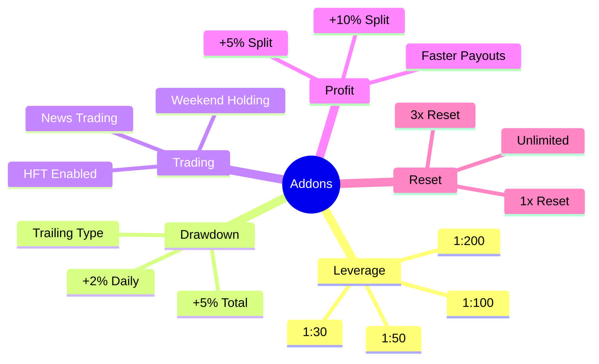
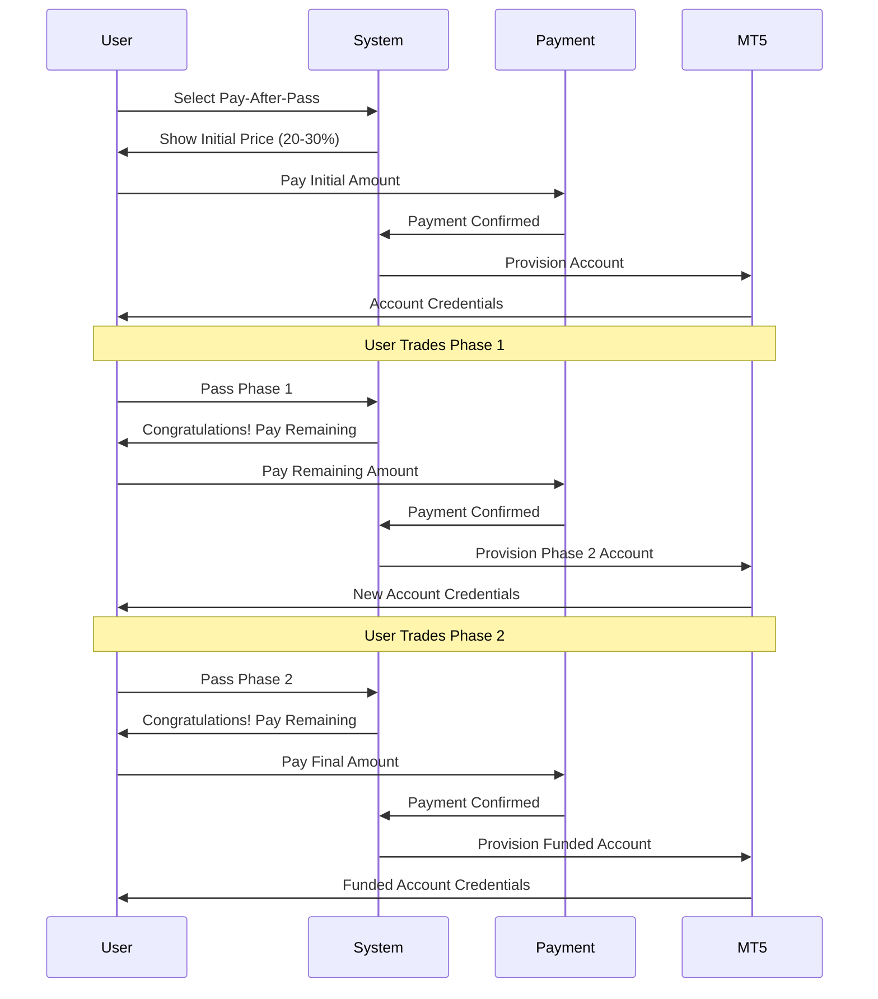

# Registration & Payment Flow

## Complete Registration and Checkout Process

```mermaid
flowchart TD
    Start([User Visits Site]) --> Landing[Landing Page]
    Landing --> SignUp[Click Sign Up]

    SignUp --> RegForm[Registration Form]
    RegForm --> FillDetails[Fill Details:<br/>Email, Password, Name,<br/>Country, Address, Phone]
    FillDetails --> OptionalRef{Has Referral Code?}

    OptionalRef -->|Yes| EnterRef[Enter Referral Code]
    OptionalRef -->|No| SubmitReg
    EnterRef --> SubmitReg[Submit Registration]

    SubmitReg --> CaptureDevice[Capture Device Fingerprint<br/>& IP Address]
    CaptureDevice --> SendOTP[Send OTP to Email]
    SendOTP --> EnterOTP[User Enters OTP]

    EnterOTP --> VerifyOTP{OTP Valid?}
    VerifyOTP -->|No| OTPFailed[Invalid OTP]
    OTPFailed --> EnterOTP

    VerifyOTP -->|Yes| CreateAccount[Create User Account]
    CreateAccount --> GenRefCode[Generate Unique<br/>Referral Code]
    GenRefCode --> RegComplete[Registration Complete]

    RegComplete --> LoginPage[Go to Login]
    LoginPage --> EnterCreds[Enter Email & Password]
    EnterCreds --> Send2FA[Send 2FA OTP]
    Send2FA --> Enter2FA[Enter 2FA Code]

    Enter2FA --> Verify2FA{2FA Valid?}
    Verify2FA -->|No| LoginFailed[Login Failed]
    LoginFailed --> LoginPage

    Verify2FA -->|Yes| TrackLogin[Track IP & Device]
    TrackLogin --> CreateSession[Create JWT Session]
    CreateSession --> Dashboard[Redirect to Dashboard]

    Dashboard --> BrowsePrograms[Browse Programs]
    BrowsePrograms --> ViewProgram[View Program Details]

    ViewProgram --> ProgramDetails[Program Information:<br/>- Challenge Type<br/>- Account Size<br/>- Profit Target<br/>- Drawdown Limits<br/>- Trading Days<br/>- Price]

    ProgramDetails --> SelectProgram[Select Program]
    SelectProgram --> CheckoutPage[Go to Checkout]

    CheckoutPage --> SelectAddons{Want Addons?}
    SelectAddons -->|Yes| BrowseAddons[Browse Available Addons]
    BrowseAddons --> AddonTypes[Addon Types:<br/>- Leverage Boost<br/>- Drawdown Extension<br/>- HFT Enabled<br/>- Profit Split Boost<br/>- Reset Options]
    AddonTypes --> SelectAddon[Select Addon/Bundle]
    SelectAddon --> AddToCart[Add to Cart]
    AddToCart --> MoreAddons{More Addons?}
    MoreAddons -->|Yes| BrowseAddons
    MoreAddons -->|No| ApplyCoupon

    SelectAddons -->|No| ApplyCoupon{Have Coupon?}
    ApplyCoupon -->|Yes| EnterCoupon[Enter Coupon Code]
    EnterCoupon --> ValidateCoupon{Valid Coupon?}
    ValidateCoupon -->|No| CouponInvalid[Invalid Coupon]
    CouponInvalid --> ApplyCoupon
    ValidateCoupon -->|Yes| ApplyDiscount[Apply Discount]
    ApplyDiscount --> CheckTier

    ApplyCoupon -->|No| CheckTier{Tier Discount?}
    CheckTier -->|Yes| ApplyTierDiscount[Apply Tier Discount<br/>Stacks with Coupon]
    CheckTier -->|No| CalculatePrice
    ApplyTierDiscount --> CalculatePrice

    CalculatePrice[Calculate Final Price:<br/>Base + Addons<br/>- Coupon<br/>- Tier Discount]

    CalculatePrice --> PaymentOption{Payment Option}

    PaymentOption -->|Full Payment| FullPrice[Pay Full Price]
    PaymentOption -->|Pay After Pass| PartialPrice[Pay Initial Price<br/>20-30% of Total]

    FullPrice --> SelectGateway
    PartialPrice --> SetExpiry[Set Pay-After-Pass<br/>Expiry Date]
    SetExpiry --> SelectGateway

    SelectGateway[Select Payment Gateway]
    SelectGateway --> GatewayOptions{Choose Gateway}

    GatewayOptions -->|Stripe| StripeCheckout[Stripe Card Payment]
    GatewayOptions -->|PayPal| PayPalCheckout[PayPal Checkout]
    GatewayOptions -->|PayGate| PayGateCheckout[PayGate.to Payment]
    GatewayOptions -->|NowPayments| CryptoNow[NowPayments Crypto]
    GatewayOptions -->|OxaPay| CryptoOxa[OxaPay Crypto]
    GatewayOptions -->|Paytiko| PaytikoCard[Paytiko Card Payment]
    GatewayOptions -->|Paysagi| PaysagiCard[Paysagi Card Payment]

    StripeCheckout --> CreatePayment[Create Payment Record]
    PayPalCheckout --> CreatePayment
    PayGateCheckout --> CreatePayment
    CryptoNow --> CreatePayment
    CryptoOxa --> CreatePayment
    PaytikoCard --> CreatePayment
    PaysagiCard --> CreatePayment

    CreatePayment --> CaptureMarketing[Capture Marketing Data:<br/>- UTM Parameters<br/>- Facebook Pixel<br/>- Google Ads<br/>- TikTok Pixel<br/>- Referrer]

    CaptureMarketing --> PaymentPending[Payment Status: Pending]
    PaymentPending --> ProcessPayment[Process Payment<br/>via Gateway]

    ProcessPayment --> WebhookReceived[Webhook Received<br/>from Gateway]
    WebhookReceived --> PaymentStatus{Payment Status}

    PaymentStatus -->|Failed| PaymentFailed[Payment Failed]
    PaymentFailed --> NotifyFailed[Email: Payment Failed]
    NotifyFailed --> RetryPayment{Retry?}
    RetryPayment -->|Yes| SelectGateway
    RetryPayment -->|No| End1([End])

    PaymentStatus -->|Success| PaymentComplete[Payment Status: Completed]
    PaymentComplete --> CreateProgram[Create User Program Record]

    CreateProgram --> ProvisionMT5[Provision MT5 Account]
    ProvisionMT5 --> MT5Process[MT5 Provisioning:<br/>1. Create Account<br/>2. Generate Credentials<br/>3. Set Broker Server<br/>4. Configure Rights<br/>5. Set Initial Balance]

    MT5Process --> StoreCredentials[Store MT5 Credentials<br/>in Database]
    StoreCredentials --> SendWelcome[Send Welcome Email:<br/>- MT5 Login<br/>- MT5 Password<br/>- Broker Server<br/>- Program Details<br/>- Trading Rules]

    SendWelcome --> DashboardNotif[In-App Notification:<br/>Account Ready]
    DashboardNotif --> UserDashboard[User Dashboard:<br/>View Account Details]

    UserDashboard --> DownloadMT5{Download MT5?}
    DownloadMT5 -->|Yes| MT5Download[Download MT5 Platform]
    MT5Download --> ConnectMT5
    DownloadMT5 -->|No| ConnectMT5[Connect to MT5]

    ConnectMT5 --> StartTrading([Ready to Trade])

    style Start fill:#e1f5e1
    style StartTrading fill:#ccffcc
    style End1 fill:#ffe1e1
    style PaymentFailed fill:#ffcccc
    style PaymentComplete fill:#ccffcc
```

## Payment Gateway Comparison

| Gateway | Type | Currencies | Processing Time | Fees |
|---------|------|------------|-----------------|------|
| Stripe | Card | USD, EUR, GBP, etc. | Instant | 2.9% + $0.30 |
| PayPal | PayPal | Multiple | Instant | 2.9% + $0.30 |
| PayGate.to | Card + Crypto | Multiple | Instant - 1 hour | Variable |
| NowPayments | Crypto | 200+ coins | 10-60 min | 0.5% - 1% |
| OxaPay | Crypto | Multiple | 10-60 min | Low fees |
| Paytiko | Card | Multiple | Instant | Variable |
| Paysagi | Card | Multiple | Instant | Variable |

## Program Types

### Challenge Types
1. **One Step**: Single phase to funded
2. **Two Step**: Phase 1 → Phase 2 → Funded
3. **Three Step**: Phase 1 → Phase 2 → Phase 3 → Funded
4. **Instant**: Immediate funded account (higher cost)
5. **Special**: Custom challenge configurations

### Account Sizes
- $2,500
- $5,000
- $10,000
- $25,000
- $50,000
- $100,000
- $200,000

## Addon Types

## Pay-After-Pass Flow

## Marketing Attribution Tracking

The system tracks:
- **UTM Parameters**: source, medium, campaign, term, content
- **Facebook Pixel**: fbclid, fbp, fbc
- **Google Ads**: gclid, gbraid, wbraid
- **TikTok**: ttclid
- **Referrer**: HTTP referrer
- **Landing Page**: First page visited
- **Device**: Browser, OS, device type
- **IP Address**: Geographic location

---

**API Endpoints**:
- `POST /api/auth/register` - User registration
- `POST /api/auth/register/verify-otp` - OTP verification
- `POST /api/auth/login` - User login
- `POST /api/payment/calculate-price` - Price calculation
- `POST /api/payment/create-payment` - Create payment
- Webhook endpoints for each gateway

**Files**:
- `pft-backend/src/app/modules/Auth/auth.routes.ts`
- `pft-backend/src/app/modules/Payment/payment.routes.ts`
- `pft-dashboard/src/app/checkout`
