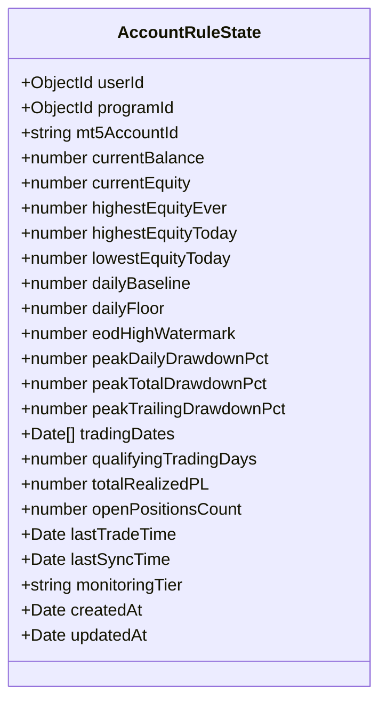
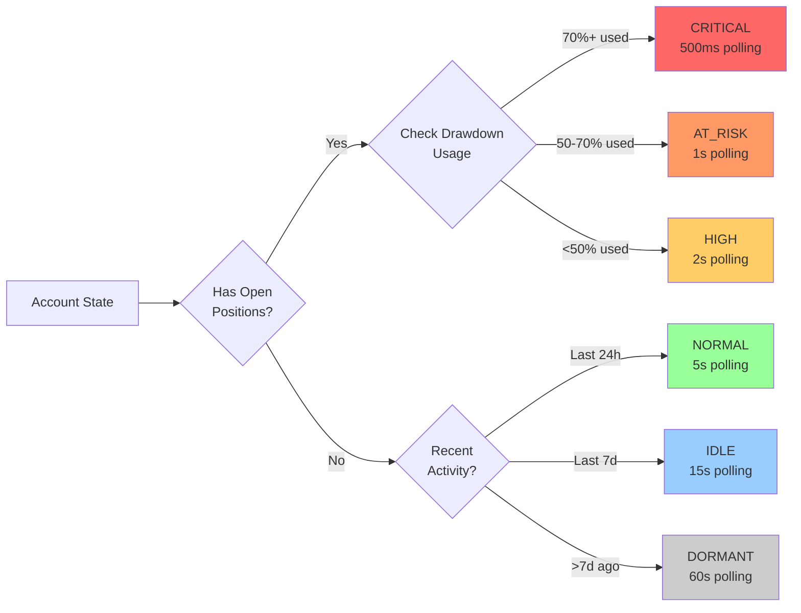
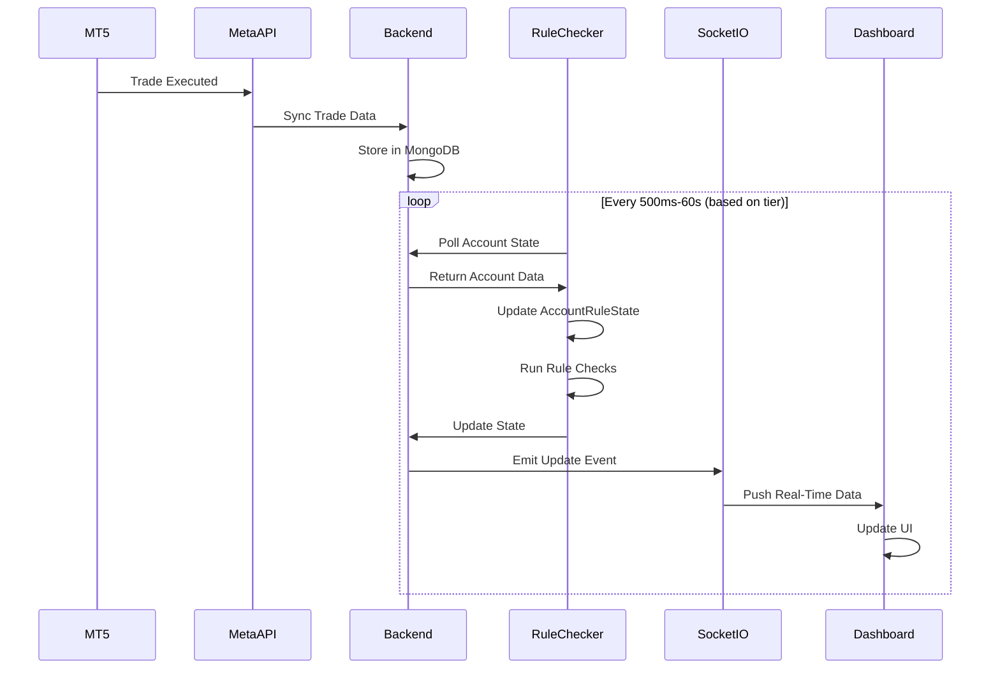
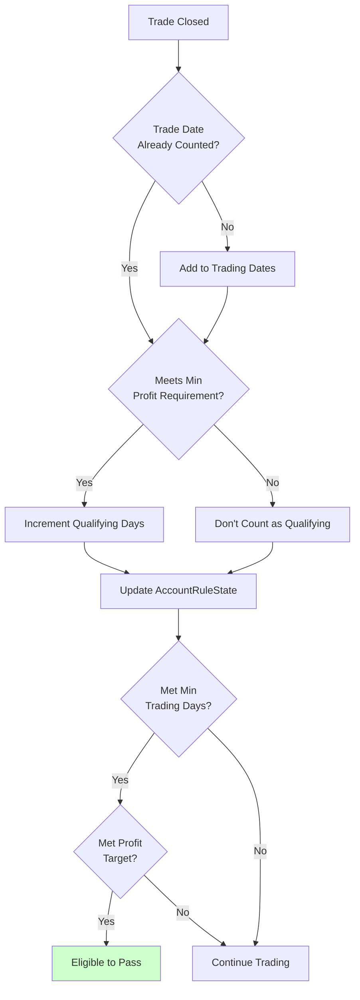

# Trading & Monitoring Flow

## Real-Time Trading and Rule Engine Monitoring

```mermaid
flowchart TD
    Start([MT5 Account Provisioned]) --> ReceiveCreds[Receive MT5 Credentials:<br/>- Login<br/>- Password<br/>- Broker Server]

    ReceiveCreds --> DownloadMT5[Download MT5 Platform]
    DownloadMT5 --> InstallMT5[Install & Configure MT5]
    InstallMT5 --> ConnectMT5[Connect to Broker Server]

    ConnectMT5 --> LoginMT5[Login with Credentials]
    LoginMT5 --> ViewAccount[View Account Dashboard]

    ViewAccount --> AccountInfo[Account Information:<br/>- Balance<br/>- Equity<br/>- Margin<br/>- Free Margin<br/>- Profit/Loss]

    AccountInfo --> ReadyToTrade[Ready to Trade]
    ReadyToTrade --> PlaceTrade{Place Trade?}

    PlaceTrade -->|Yes| SelectSymbol[Select Trading Symbol]
    SelectSymbol --> AnalyzeMarket[Analyze Market]
    AnalyzeMarket --> SetParameters[Set Trade Parameters:<br/>- Volume/Lot Size<br/>- Stop Loss<br/>- Take Profit<br/>- Order Type]

    SetParameters --> ExecuteTrade[Execute Trade]
    ExecuteTrade --> TradeOpened[Trade Opened]

    TradeOpened --> MetaAPISync[MetaAPI Syncs Trade]
    MetaAPISync --> BackendReceives[Backend Receives Trade Data]
    BackendReceives --> StoreInDB[Store in MongoDB]

    StoreInDB --> RuleCheckerPoll[Rule Checker Polls Account]
    RuleCheckerPoll --> DetermineTier[Determine Monitoring Tier]

    DetermineTier --> TierCheck{Account Tier?}

    TierCheck -->|CRITICAL<br/>70%+ limit used| Poll500ms[Poll Every 500ms<br/>2x per second]
    TierCheck -->|AT_RISK<br/>50%+ limit used| Poll1s[Poll Every 1 Second]
    TierCheck -->|HIGH<br/>Has open positions| Poll2s[Poll Every 2 Seconds]
    TierCheck -->|NORMAL<br/>Recent activity| Poll5s[Poll Every 5 Seconds]
    TierCheck -->|IDLE<br/>No recent trades| Poll15s[Poll Every 15 Seconds]
    TierCheck -->|DORMANT<br/>Very inactive| Poll60s[Poll Every 60 Seconds]

    Poll500ms --> FetchAccountState
    Poll1s --> FetchAccountState
    Poll2s --> FetchAccountState
    Poll5s --> FetchAccountState
    Poll15s --> FetchAccountState
    Poll60s --> FetchAccountState

    FetchAccountState[Fetch Current Account State]
    FetchAccountState --> UpdateRuleState[Update AccountRuleState]

    UpdateRuleState --> ComputeMetrics[Compute Pre-calculated Metrics:<br/>- Current Balance/Equity<br/>- Highest Equity Ever<br/>- Highest Equity Today<br/>- Lowest Equity Today<br/>- Daily Baseline/Floor<br/>- EOD High Watermark<br/>- Peak Drawdown %<br/>- Trading Days Count<br/>- Qualifying Days<br/>- Total Realized P/L]

    ComputeMetrics --> RunRuleChecks[Run Rule Checks]

    RunRuleChecks --> CheckDailyDD[Check Daily Drawdown]
    CheckDailyDD --> CheckMaxDD[Check Max/Total Drawdown]
    CheckMaxDD --> CheckTrailingDD[Check Trailing Drawdown]
    CheckTrailingDD --> CheckProfitTarget[Check Profit Target]
    CheckProfitTarget --> CheckMinDuration[Check Min Trade Duration]
    CheckMinDuration --> CheckLotSize[Check Lot Size Limits]
    CheckLotSize --> CheckStopLoss[Check Mandatory Stop Loss]
    CheckStopLoss --> CheckTakeProfit[Check Mandatory Take Profit]
    CheckTakeProfit --> CheckWeekend[Check Weekend Holding]
    CheckWeekend --> CheckTradingDays[Check Min Trading Days]

    CheckTradingDays --> RuleResult{Rule Violation?}

    RuleResult -->|Yes - BREACH| BreachDetected[BREACH DETECTED]
    BreachDetected --> BreachFlow[Go to Breach Flow]

    RuleResult -->|No - PASS| PassCheck{Profit Target Met?}
    PassCheck -->|Yes| PassFlow[Go to Pass Flow]

    PassCheck -->|No| UpdateDashboard[Update Dashboard via Socket.io]

    UpdateDashboard --> DashboardDisplay[Dashboard Shows:<br/>- Real-time Balance<br/>- Real-time Equity<br/>- Open Positions<br/>- Floating P/L<br/>- Drawdown Progress<br/>- Profit Target Progress<br/>- Trading Days Progress<br/>- Recent Trades]

    DashboardDisplay --> TradeManagement{Trade Management}

    TradeManagement -->|Modify Trade| ModifyTrade[Modify Stop Loss/<br/>Take Profit]
    ModifyTrade --> MetaAPISync

    TradeManagement -->|Close Trade| CloseTrade[Close Position]
    CloseTrade --> RealizeProfit[Realize Profit/Loss]
    RealizeProfit --> UpdateBalance[Update Balance]
    UpdateBalance --> MetaAPISync

    TradeManagement -->|Open New Trade| PlaceTrade

    TradeManagement -->|Monitor| ContinueMonitor[Continue Monitoring]
    ContinueMonitor --> RuleCheckerPoll

    PlaceTrade -->|No| MonitorOnly[Monitor Existing Positions]
    MonitorOnly --> RuleCheckerPoll

    style Start fill:#e1f5e1
    style BreachDetected fill:#ffcccc
    style PassFlow fill:#ccffcc
    style Poll500ms fill:#ff9999
    style Poll1s fill:#ffcc99
    style Poll2s fill:#ffff99
```



## Account Rule State Model



## Monitoring Tier Logic



## Rule Checks Performed

### 1. Daily Drawdown Check
```javascript
// Three types: basic, eod, trailing
if (dailyDrawdownType === 'basic') {
  // Balance-based, can go up or down
  baseline = balanceAtEOD;
  floor = baseline * (1 - dailyLossLimitPct);
  violation = currentBalance < floor;
}
else if (dailyDrawdownType === 'eod') {
  // EOD equity-based, recalculates daily
  baseline = max(balance, equity) at EOD;
  floor = baseline * (1 - dailyLossLimitPct);
  violation = currentEquity < floor;
}
else if (dailyDrawdownType === 'trailing') {
  // Trailing, only ratchets up
  baseline = highest max(balance, equity) ever at EOD;
  floor = baseline * (1 - dailyLossLimitPct);
  violation = currentEquity < floor;
}
```

### 2. Max/Total Drawdown Check
```javascript
// Based on highest equity ever
maxDrawdownFloor = highestEquityEver * (1 - maxDrawdownPct);
violation = currentEquity < maxDrawdownFloor;
```

### 3. Trailing Drawdown Check
```javascript
// Based on highest equity today
trailingFloor = highestEquityToday * (1 - trailingDrawdownPct);
violation = currentEquity < trailingFloor;
```

### 4. Profit Target Check
```javascript
// Check if profit target reached
profitPct = ((currentEquity - initialBalance) / initialBalance) * 100;
targetMet = profitPct >= profitTargetPct;
```

### 5. Minimum Trade Duration Check
```javascript
// Check if trades held for minimum duration
for (trade of closedTrades) {
  duration = trade.closeTime - trade.openTime;
  if (duration < minTradeDurationSeconds) {
    violation = true;
  }
}
```

### 6. Lot Size Check
```javascript
// Check if lot sizes within limits
for (position of openPositions) {
  if (position.volume > maxLotSize) {
    violation = true;
  }
}
```

### 7. Mandatory Stop Loss Check
```javascript
// Check if all positions have stop loss
for (position of openPositions) {
  if (!position.stopLoss && mandatoryStopLoss) {
    violation = true;
  }
}
```

### 8. Mandatory Take Profit Check
```javascript
// Check if all positions have take profit
for (position of openPositions) {
  if (!position.takeProfit && mandatoryTakeProfit) {
    violation = true;
  }
}
```

### 9. Weekend Holding Check
```javascript
// Check if positions held over weekend
if (isWeekend() && openPositionsCount > 0 && !allowWeekendHolding) {
  violation = true;
}
```

### 10. Minimum Trading Days Check
```javascript
// Check if minimum trading days met
if (tradingDates.length >= minTradingDays) {
  requirementMet = true;
}
```

## Dashboard Real-Time Updates



## Trading Days Calculation



## Example Trading Scenario

### Scenario: $100,000 Account with 5% Daily Drawdown (Trailing Type)

| Day | EOD Balance | EOD Equity | Highest Ever | Daily Floor | Status |
|-----|-------------|------------|--------------|-------------|--------|
| 1 | $100,000 | $100,000 | $100,000 | $95,000 | Safe |
| 2 | $102,000 | $102,000 | $102,000 | $96,900 | Safe (floor raised) |
| 3 | $101,000 | $101,000 | $102,000 | $96,900 | Safe (floor locked) |
| 4 | $103,000 | $103,000 | $103,000 | $97,850 | Safe (floor raised) |
| 5 | $102,500 | $97,500 | $103,000 | $97,850 | **BREACH** (below floor) |

---

**API Endpoints**:
- `GET /api/programs/:id/account-state` - Get current account state
- `GET /api/programs/:id/trades` - Get trade history
- `GET /api/programs/:id/positions` - Get open positions
- `GET /api/programs/:id/statistics` - Get trading statistics

**Socket.io Events**:
- `account:update` - Real-time account updates
- `trade:opened` - New trade opened
- `trade:closed` - Trade closed
- `position:modified` - Position modified
- `breach:detected` - Breach detected
- `target:reached` - Profit target reached

**Files**:
- `pft-rule-checker/src/app/services/rule-engine/rule.service.ts`
- `pft-rule-checker/src/app/models/accountRuleState.interface.ts`
- `pft-backend/src/app/modules/Programs/program.routes.ts`
- `pft-dashboard/src/app/(dashboard)/_components/modules/users/dashboard`
