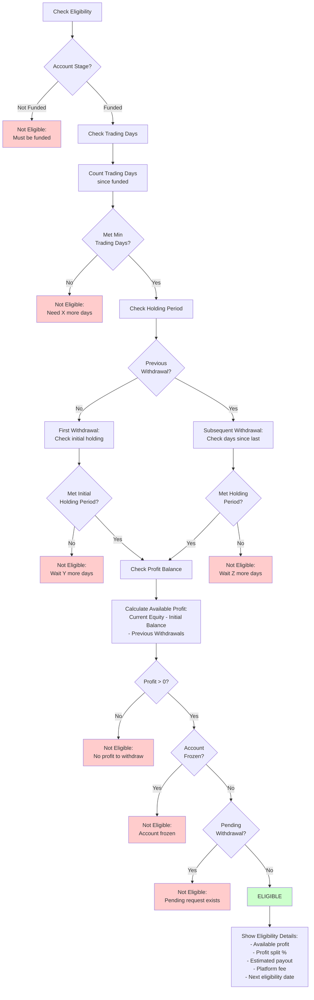
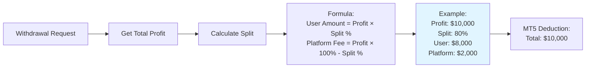
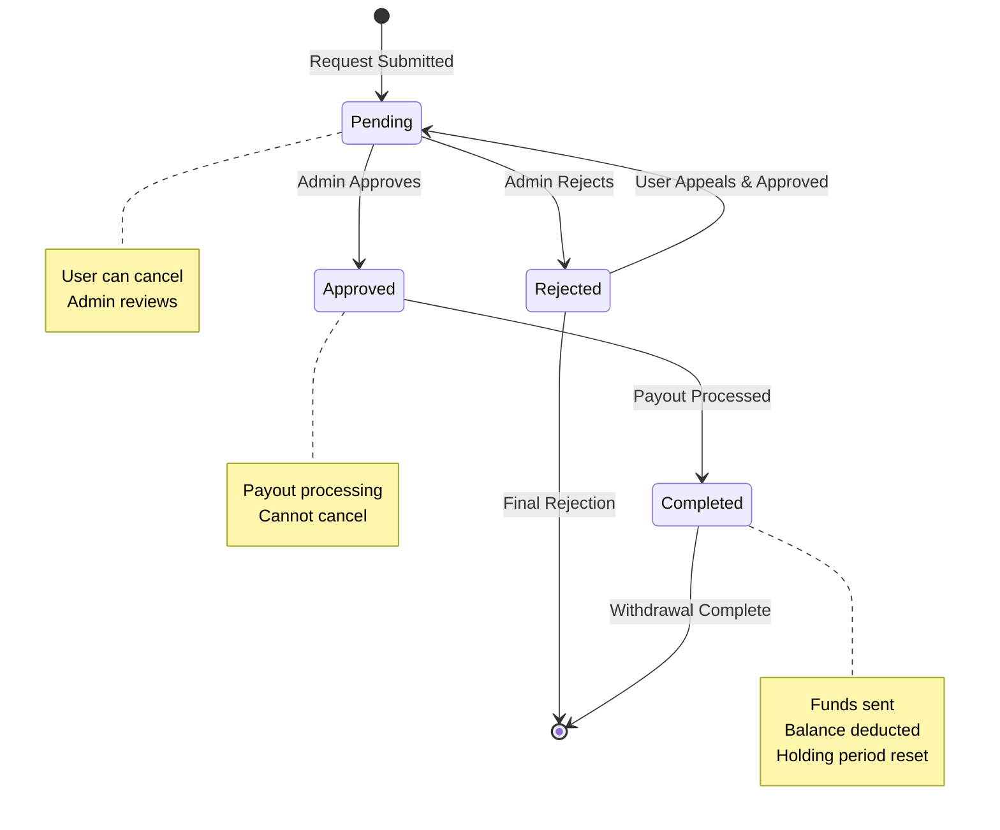
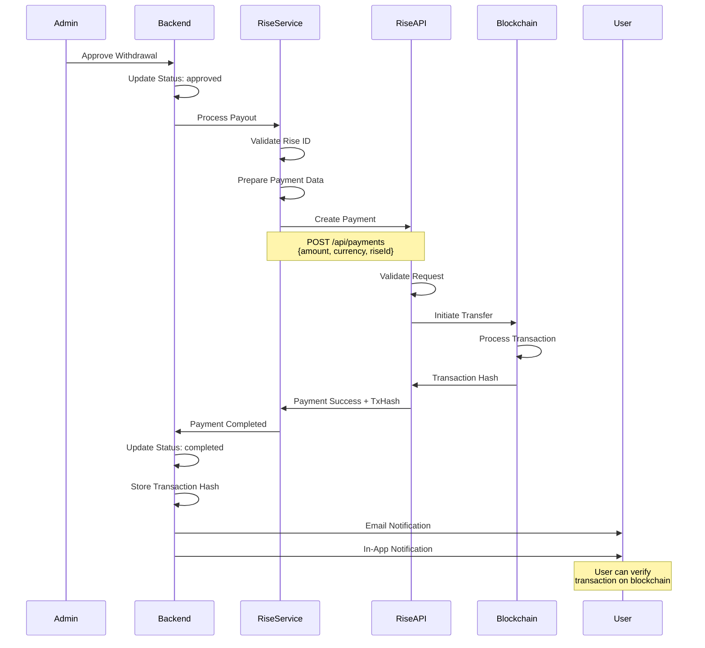
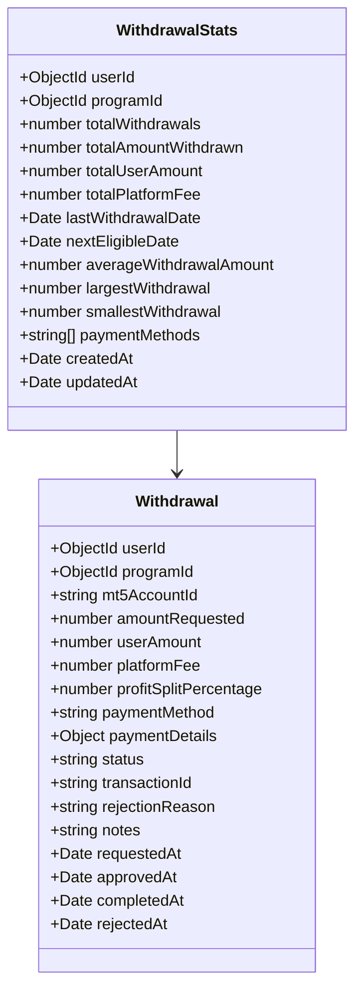
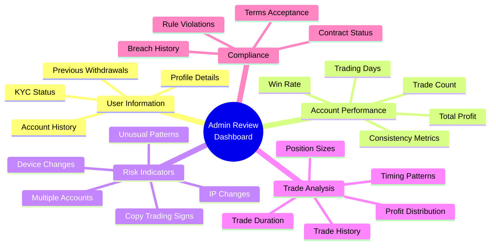
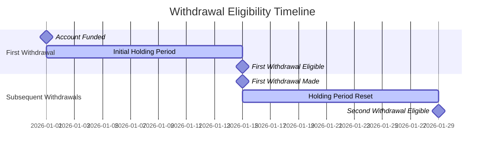

# Withdrawal Flow

## Complete Withdrawal Request and Payout Process

```mermaid
flowchart TD
    Start([Funded Account Trading]) --> CheckEligibility[Check Withdrawal Eligibility]

    CheckEligibility --> Criteria[Eligibility Criteria:<br/>- Funded account stage<br/>- Min trading days met<br/>- Holding period satisfied<br/>- Account not frozen<br/>- No pending withdrawals<br/>- Positive profit balance]

    Criteria --> EligibilityCheck{Eligible?}

    EligibilityCheck -->|No| ShowReasons[Show Ineligibility Reasons]
    ShowReasons --> ReasonsDisplay{Reason?}

    ReasonsDisplay -->|Not Funded| NotFunded[Must pass to funded stage]
    ReasonsDisplay -->|Trading Days| NeedMoreDays[Need X more trading days]
    ReasonsDisplay -->|Holding Period| HoldingPeriod[Must wait Y more days<br/>since last withdrawal]
    ReasonsDisplay -->|No Profit| NoProfit[No profit to withdraw]
    ReasonsDisplay -->|Account Frozen| Frozen[Account frozen by admin]
    ReasonsDisplay -->|Pending Request| PendingExists[Already have pending request]

    NotFunded --> ContinueTrading[Continue Trading]
    NeedMoreDays --> ContinueTrading
    HoldingPeriod --> ContinueTrading
    NoProfit --> ContinueTrading
    Frozen --> ContactSupport[Contact Support]
    PendingExists --> WaitForReview[Wait for Admin Review]

    EligibilityCheck -->|Yes| RequestWithdrawal[Request Withdrawal]

    RequestWithdrawal --> WithdrawalForm[Withdrawal Form]

    WithdrawalForm --> EnterAmount[Enter Withdrawal Amount]
    EnterAmount --> ValidateAmount{Amount Valid?}

    ValidateAmount -->|No| AmountError[Error:<br/>- Exceeds available profit<br/>- Below minimum<br/>- Above maximum]
    AmountError --> EnterAmount

    ValidateAmount -->|Yes| SelectMethod[Select Payment Method]

    SelectMethod --> MethodOptions{Payment Method}

    MethodOptions -->|Rise Crypto| RiseSetup[Rise Payout Setup]
    RiseSetup --> EnterRiseID[Enter Rise ID<br/>Crypto Wallet Address]
    EnterRiseID --> ValidateRise{Valid Rise ID?}
    ValidateRise -->|No| RiseError[Invalid Rise ID]
    RiseError --> EnterRiseID
    ValidateRise -->|Yes| ConfirmDetails

    MethodOptions -->|Bank Transfer| BankSetup[Bank Transfer Setup]
    BankSetup --> EnterBankDetails[Enter Bank Details:<br/>- Account holder name<br/>- Bank name<br/>- Account number<br/>- Routing number<br/>- SWIFT/IBAN<br/>- Country]
    EnterBankDetails --> ValidateBank{Valid Details?}
    ValidateBank -->|No| BankError[Invalid bank details]
    BankError --> EnterBankDetails
    ValidateBank -->|Yes| ConfirmDetails

    MethodOptions -->|PayPal| PayPalSetup[PayPal Setup]
    PayPalSetup --> EnterPayPal[Enter PayPal Email]
    EnterPayPal --> ValidatePayPal{Valid Email?}
    ValidatePayPal -->|No| PayPalError[Invalid PayPal email]
    PayPalError --> EnterPayPal
    ValidatePayPal -->|Yes| ConfirmDetails

    ConfirmDetails[Confirm Withdrawal Details]
    ConfirmDetails --> ReviewDetails[Review:<br/>- Withdrawal amount<br/>- Payment method<br/>- Profit split %<br/>- Platform fee<br/>- Net payout amount]

    ReviewDetails --> AddNotes{Add Notes?}
    AddNotes -->|Yes| EnterNotes[Enter Notes/Comments]
    EnterNotes --> SubmitRequest
    AddNotes -->|No| SubmitRequest[Submit Withdrawal Request]

    SubmitRequest --> ValidateTrades[Validate Trade Integrity]

    ValidateTrades --> TradeCheck{Trades<br/>Complete?}

    TradeCheck -->|No| ResyncTrades[Resync Trades from MT5]
    ResyncTrades --> TradeCheck

    TradeCheck -->|Yes| CalculateSplit[Calculate Profit Split]

    CalculateSplit --> SplitCalc[Calculation:<br/>User Amount = Profit × Split %<br/>Platform Fee = Profit × 100% - Split %<br/>Total Deduction = User Amount + Fee]

    SplitCalc --> CreateRequest[Create Withdrawal Record]

    CreateRequest --> RequestData[Request Data:<br/>- Status: pending<br/>- Amount requested<br/>- User amount<br/>- Platform fee<br/>- Payment method<br/>- Payment details<br/>- Program ID<br/>- MT5 account<br/>- Profit split %<br/>- Notes<br/>- Created timestamp]

    RequestData --> NotifyUser[Notify User:<br/>- Email confirmation<br/>- In-app notification<br/>- Request ID<br/>- Expected review time]

    NotifyUser --> NotifyAdmin[Notify Admin:<br/>- New withdrawal request<br/>- User details<br/>- Amount<br/>- Dashboard alert]

    NotifyAdmin --> AdminQueue[Add to Admin Review Queue]

    AdminQueue --> AdminReview[Admin Reviews Request]

    AdminReview --> AdminDashboard[Admin Dashboard Shows:<br/>- User profile<br/>- Account history<br/>- Trade history<br/>- Previous withdrawals<br/>- Account performance<br/>- Risk indicators<br/>- Suspicious activity flags]

    AdminDashboard --> VerifyTrades[Verify Trade Legitimacy]

    VerifyTrades --> CheckPatterns[Check for:<br/>- Unusual trading patterns<br/>- Suspicious timing<br/>- Multiple accounts<br/>- Rule violations<br/>- Manipulation attempts<br/>- Copy trading<br/>- Expert advisors]

    CheckPatterns --> SuspiciousCheck{Suspicious<br/>Activity?}

    SuspiciousCheck -->|Yes| FlagForReview[Flag for Investigation]
    FlagForReview --> DeepInvestigation[Deep Investigation:<br/>- IP analysis<br/>- Device fingerprints<br/>- Trade correlation<br/>- Timing analysis<br/>- Pattern matching]

    DeepInvestigation --> InvestigationResult{Investigation<br/>Result?}

    InvestigationResult -->|Fraudulent| RejectWithdrawal[Reject Withdrawal]
    InvestigationResult -->|Legitimate| ApproveWithdrawal

    SuspiciousCheck -->|No| VerifyBalance[Verify MT5 Balance]

    VerifyBalance --> BalanceCheck{Balance<br/>Sufficient?}

    BalanceCheck -->|No| InsufficientFunds[Insufficient Funds]
    InsufficientFunds --> RejectWithdrawal

    BalanceCheck -->|Yes| AdjustAmount{Admin Adjust<br/>Amount?}

    AdjustAmount -->|Yes| EnterAdjusted[Enter Adjusted Amount<br/>& Reason]
    EnterAdjusted --> ApproveWithdrawal
    AdjustAmount -->|No| ApproveWithdrawal[Approve Withdrawal]

    ApproveWithdrawal --> UpdateStatus[Update Status: approved]
    UpdateStatus --> NotifyApproval[Notify User:<br/>- Withdrawal approved<br/>- Payout processing<br/>- Expected timeline]

    NotifyApproval --> ProcessPayout[Process Payout]

    ProcessPayout --> PayoutMethod{Payout Method}

    PayoutMethod -->|Rise Crypto| RisePayout[Rise Payout Service]
    RisePayout --> ValidateRiseID[Validate Rise ID]
    ValidateRiseID --> CreateRisePayment[Create Rise Payment]
    CreateRisePayment --> RiseAPI[Call Rise API]

    RiseAPI --> RiseStatus{Rise Response}

    RiseStatus -->|Success| RiseTxHash[Get Transaction Hash]
    RiseTxHash --> RecordTx[Record Transaction]
    RecordTx --> PayoutComplete

    RiseStatus -->|Failed| RiseError2[Rise Payment Failed]
    RiseError2 --> NotifyRiseError[Notify Admin:<br/>Rise payment error]
    NotifyRiseError --> ManualFallback[Manual Fallback Required]

    PayoutMethod -->|Manual| ManualPayout[Manual Payout Process]
    ManualPayout --> AdminProcesses[Admin Processes Payment:<br/>- Bank transfer<br/>- PayPal<br/>- Other method]

    AdminProcesses --> EnterTxID[Enter Transaction ID]
    EnterTxID --> UploadProof{Upload Proof?}
    UploadProof -->|Yes| AttachProof[Attach Payment Proof]
    UploadProof -->|No| MarkComplete
    AttachProof --> MarkComplete[Mark as Completed]

    MarkComplete --> PayoutComplete[Payout Complete]

    PayoutComplete --> UpdateStatusComplete[Update Status: completed]
    UpdateStatusComplete --> DeductMT5[Deduct from MT5 Balance]

    DeductMT5 --> MT5Operations[MT5 Operations:<br/>1. Calculate deduction<br/>2. Update balance<br/>3. Record transaction<br/>4. Sync with MetaAPI]

    MT5Operations --> UpdateStats[Update Withdrawal Statistics:<br/>- Total withdrawals count<br/>- Total amount withdrawn<br/>- Last withdrawal date<br/>- Average withdrawal amount]

    UpdateStats --> ResetHolding[Reset Holding Period:<br/>Start new X-day countdown]

    ResetHolding --> NotifyComplete[Notify User:<br/>- Email: Payout completed<br/>- Transaction details<br/>- New balance<br/>- Next withdrawal eligibility]

    NotifyComplete --> InAppUpdate[In-App Notification:<br/>- Payout successful<br/>- View transaction<br/>- Download receipt]

    InAppUpdate --> SocketUpdate[Socket.io Update:<br/>- Event: withdrawal:completed<br/>- Balance updated<br/>- Dashboard refresh]

    SocketUpdate --> ContinueTradingPost[Continue Trading]
    ContinueTradingPost --> NextWithdrawal{Request Another<br/>Withdrawal?}

    NextWithdrawal -->|Yes| WaitHolding[Wait for Holding Period]
    WaitHolding --> CheckEligibility

    NextWithdrawal -->|No| End1([End])

    RejectWithdrawal --> ProvideReason[Provide Rejection Reason]
    ProvideReason --> UpdateStatusRejected[Update Status: rejected]
    UpdateStatusRejected --> NotifyRejection[Notify User:<br/>- Email: Withdrawal rejected<br/>- Rejection reason<br/>- Next steps<br/>- Appeal process]

    NotifyRejection --> UserAppeal{User<br/>Appeals?}

    UserAppeal -->|Yes| AppealProcess[Appeal Process]
    AppealProcess --> SecondReview[Second Admin Review]
    SecondReview --> AppealDecision{Appeal<br/>Decision?}

    AppealDecision -->|Approve| ApproveWithdrawal
    AppealDecision -->|Deny| FinalRejection[Final Rejection]
    FinalRejection --> End2([End])

    UserAppeal -->|No| End2

    ContinueTrading --> End3([Continue Trading])

    style ApproveWithdrawal fill:#ccffcc
    style PayoutComplete fill:#99ff99
    style RejectWithdrawal fill:#ffcccc
    style FinalRejection fill:#ff9999
    style End1 fill:#e1f5e1
    style End2 fill:#ffe1e1
```

## Withdrawal Eligibility Calculation

## Profit Split Calculation

## Withdrawal Status Flow

## Rise Payout Integration

## Withdrawal Statistics Tracking

## Admin Review Dashboard

## Withdrawal Limits and Rules

| Rule | Description | Typical Value |
|------|-------------|---------------|
| **Minimum Withdrawal** | Minimum amount per request | $100 - $500 |
| **Maximum Withdrawal** | Maximum amount per request | $50,000 - $100,000 |
| **Minimum Trading Days** | Days required before first withdrawal | 5-10 days |
| **Holding Period** | Days between withdrawals | 7-14 days |
| **Profit Split** | User's share of profit | 70-90% |
| **Platform Fee** | Platform's share | 10-30% |
| **Processing Time** | Time to process payout | 1-5 business days |

## Payment Methods Comparison

| Method | Speed | Fees | Limits | Verification |
|--------|-------|------|--------|--------------|
| **Rise Crypto** | 10-60 min | Low (0.5-1%) | High | Wallet address |
| **Bank Transfer** | 3-5 days | Medium | High | Bank details |
| **PayPal** | 1-2 days | Medium (2.9%) | Medium | Email verified |
| **Wire Transfer** | 1-3 days | High ($25-50) | Very High | Full bank info |

## Holding Period Countdown

## Rejection Reasons

Common rejection reasons:
1. **Suspicious Trading Activity**
   - Unusual patterns detected
   - Copy trading suspected
   - Manipulation attempts

2. **Insufficient Trading Days**
   - Not enough trading activity
   - Minimum days not met

3. **Rule Violations**
   - Past breaches
   - Current violations
   - Terms violations

4. **Account Issues**
   - Frozen account
   - Pending investigation
   - KYC incomplete

5. **Technical Issues**
   - Insufficient balance
   - MT5 sync errors
   - Payment method invalid

6. **Fraud Prevention**
   - Multiple accounts
   - IP/device mismatch
   - Identity verification failed

---

**API Endpoints**:
- `GET /api/withdrawals/payout-eligibility` - Check eligibility
- `POST /api/withdrawals` - Create withdrawal request
- `GET /api/withdrawals/my-withdrawals` - Get user's withdrawals
- `GET /api/withdrawals/my-stats` - Get withdrawal statistics
- `GET /api/admin/withdrawals` - List all withdrawals (admin)
- `POST /api/admin/withdrawals/:id/approve` - Approve withdrawal (admin)
- `POST /api/admin/withdrawals/:id/reject` - Reject withdrawal (admin)
- `POST /api/admin/withdrawals/:id/complete` - Mark completed (admin)
- `GET /api/withdrawals/account/:accountId/stats` - Per-account stats

**Socket.io Events**:
- `withdrawal:requested` - New withdrawal request
- `withdrawal:approved` - Withdrawal approved
- `withdrawal:rejected` - Withdrawal rejected
- `withdrawal:completed` - Payout completed
- `balance:updated` - MT5 balance updated

**Files**:
- `pft-backend/src/app/modules/Withdrawals/withdrawal.routes.ts`
- `pft-backend/src/app/modules/Withdrawals/withdrawal.service.ts`
- `pft-backend/src/app/modules/Withdrawals/services/rise-payout.service.ts`
- `pft-dashboard/src/app/(dashboard)/_components/modules/users/withdrawals`
