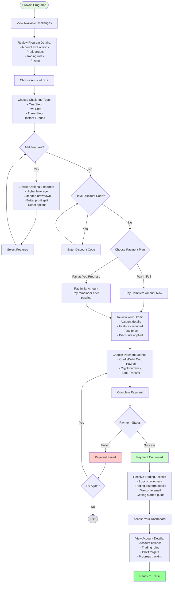
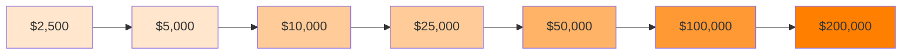

# Account Purchase Flow

## Simple Path to Your Trading Account

## Account Size Options

## Challenge Types Comparison

| Challenge Type | Stages | Time to Funded | Best For |
|---------------|--------|----------------|----------|
| **One Step** | 1 phase | Fastest | Experienced traders |
| **Two Step** | 2 phases | Moderate | Most traders |
| **Three Step** | 3 phases | Longer | Conservative approach |
| **Instant Funded** | 0 phases | Immediate | Skip evaluation |

## Payment Plans

### Pay in Full
- **Pay once**: Complete payment upfront
- **Immediate access**: Start trading right away
- **No future payments**: All stages included
- **Best value**: Often includes discounts

### Pay as You Progress
- **Lower initial cost**: Pay 20-30% to start
- **Pay after passing**: Pay remainder when you advance
- **Flexible**: Only pay more if you succeed
- **Risk reduction**: Lower upfront investment

## Optional Features

### Performance Enhancements
- **Higher Leverage**: Trade with more buying power
- **Extended Drawdown**: More room for trading strategies
- **Better Profit Split**: Keep more of your earnings

### Trading Flexibility
- **High-Frequency Trading**: No restrictions on trade duration
- **News Trading**: Trade during major announcements
- **Weekend Holding**: Keep positions over weekends

### Safety Net
- **Reset Options**: Restart if you breach rules
- **Multiple Attempts**: Get extra chances to pass

## What You Receive

### Immediate Access
- Trading account credentials
- Platform download links
- Account dashboard access
- Real-time progress tracking

### Support Materials
- Welcome email with all details
- Trading rules and guidelines
- Profit target information
- Risk management limits

### Ongoing Benefits
- 24/7 dashboard access
- Real-time balance updates
- Performance analytics
- Achievement tracking

---

**Simple, transparent pricing. Choose what works for you.**
