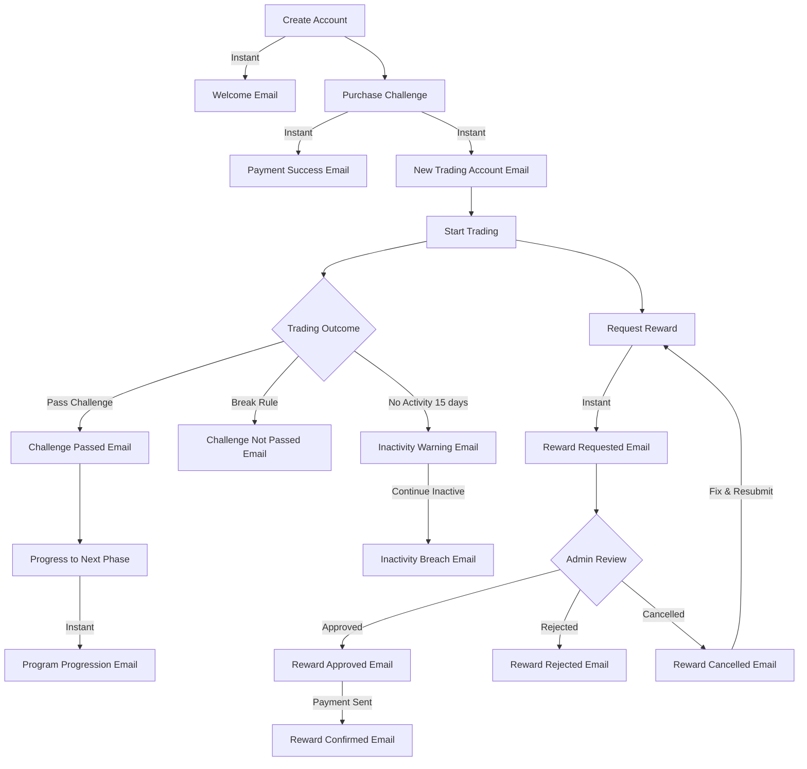
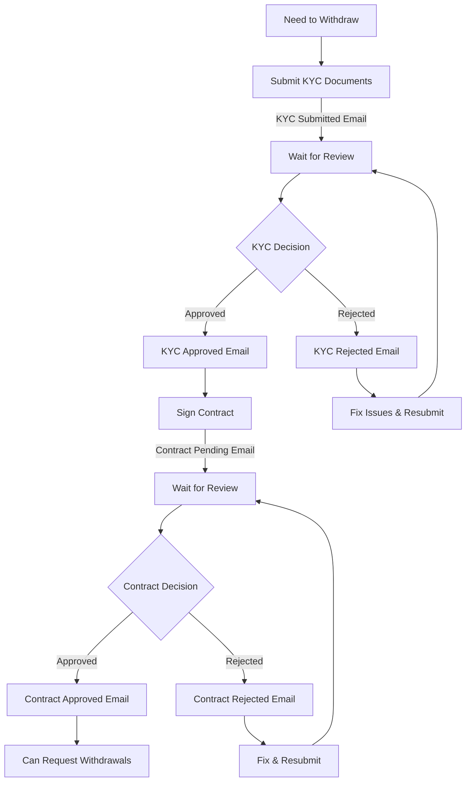

# Email Notifications - User Guide

## Overview

This guide explains all email notifications you'll receive throughout your journey on the platform. Emails are sent automatically at key moments to keep you informed about your account status, trading progress, and important actions.

---

## Getting Started Emails

### Welcome Email
**When you receive it**: Immediately after creating your account

**What it contains**:
- Welcome message with your name
- Next steps to get started
- Links to important resources

**What to do**: Check your inbox (and spam folder) to confirm your email address is working correctly.

---

### Two-Factor Authentication Code
**When you receive it**: When logging in from a new device or location, or if you have 2FA enabled

**What it contains**:
- 6-digit verification code
- Security reminder about protecting your account

**What to do**: Enter the code on the login page within a few minutes (codes expire quickly for security).

---

### Password Reset
**When you receive it**: When you click "Forgot Password" on the login page

**What it contains**:
- Secure link to reset your password
- Link expiration time (usually 1 hour)

**What to do**: Click the link and create a new strong password. If you didn't request this, ignore the email and your account remains secure.

---

### Admin Created Your Account
**When you receive it**: When an administrator creates an account for you

**What it contains**:
- Your login email
- Temporary password
- Link to the dashboard
- Instructions to change your password

**What to do**: Log in with the temporary password and immediately change it to something secure.

---

### Password Set Successfully
**When you receive it**: After you successfully change or set your password

**What it contains**:
- Confirmation that your password was updated
- Security tips

**What to do**: No action needed - this is just a confirmation for your security.

---

## Trading Account Emails

### New Trading Account Created
**When you receive it**: After purchasing a challenge or when an admin assigns you an account

**What it contains**:
- Your MT5 account login credentials
- Account number (MT5 ID)
- Password for MT5 platform
- Broker server address
- Program details (account size, rules, profit targets)
- Trading rules summary

**What to do**: Save these credentials securely! You'll need them to log into the MT5 trading platform.

---

## Challenge Progress Emails

### Challenge Passed
**When you receive it**: When you successfully complete all challenge requirements

**What it contains**:
- Congratulations message
- Your final account balance
- Profit amount achieved
- Number of trading days completed
- Next steps for progression

**What to do**: Celebrate! Check your dashboard for information about moving to the next phase.

---

### Challenge Not Passed (Breach Notification)
**When you receive it**: When your challenge account violates a trading rule

**What it contains**:
- Explanation of which rule was breached
- Account details at the time of breach
- Your equity and balance when the breach occurred
- Specific violation details (e.g., daily loss limit exceeded)
- Link to purchase a new challenge

**What to do**: Review the breach details to understand what happened. You can purchase a new challenge when you're ready to try again.

---

### Program Progression
**When you receive it**: When you advance to the next phase of your program

**What it contains**:
- Congratulations on your progression
- New account credentials (MT5 ID and password)
- New account details and rules
- Broker server information
- What changed from your previous phase

**What to do**: Log into MT5 with your new credentials and start trading on your next phase account.

---

### Funded Account Breach
**When you receive it**: When your funded account violates a trading rule

**What it contains**:
- Detailed explanation of the rule violation
- Account state at breach (equity, balance, floating P&L)
- Breach type and specific limits exceeded
- Impact on your funded status

**What to do**: Review the breach details carefully. Contact support if you have questions about the breach.

---

## Reward (Trading Profit Withdrawal) Emails

> **Note**: "Reward" refers to withdrawing your trading profits from a funded account. This is separate from Affiliate Withdrawals (referral commissions). Some platforms may label these as "Payout" instead of "Reward" — the process is identical.

### Reward Requested
**When you receive it**: Immediately after you submit a withdrawal request

**What it contains**:
- Confirmation of your withdrawal request
- Requested amount
- Platform fees (if applicable)
- Total amount to be received
- Expected processing timeline

**What to do**: Wait for admin review. You'll receive another email when your request is processed.

---

### Reward Approved
**When you receive it**: When an administrator approves your reward request

**What it contains**:
- Approval confirmation
- Transaction ID
- Amount being sent
- Your wallet address
- Network details (if crypto)
- Estimated completion time

**What to do**: Your payment is being processed. You'll receive a confirmation email when it's completed.

---

### Reward Confirmed
**When you receive it**: When your reward payment is completed

**What it contains**:
- Payment completion confirmation
- Transaction ID for tracking
- Final amount sent
- Transaction fees
- Wallet address where funds were sent
- Transaction date and time

**What to do**: Check your wallet or payment method to confirm receipt. Keep this email for your records.

---

### Reward Rejected
**When you receive it**: When an administrator rejects your reward request due to a rule violation, suspicious activity, or other compliance issue

**What it contains**:
- Rejection notification
- Reason for rejection
- Withdrawal amount and date
- Rejection date

**What to do**: Read the rejection reason carefully. A rejection may include a balance penalty on your trading account depending on the circumstances. Contact support if you need clarification or believe this was an error.

> **Note**: Rejection is different from cancellation. A rejection means there was an issue with your withdrawal eligibility or compliance. Your account balance may be affected.

---

### Reward Cancelled
**When you receive it**: When an administrator cancels your reward request due to an administrative issue (e.g., incorrect wallet address, wrong payment details, or at your own request)

**What it contains**:
- Cancellation notification
- Cancellation reason
- Withdrawal amount and date
- Cancellation date

**What to do**: Review the cancellation reason. Cancellation does not affect your account balance or trading metrics. You can immediately submit a new withdrawal request with the corrected information.

> **Note**: Cancellation is a neutral action — no penalty is applied. Simply fix the issue (e.g., correct your wallet address) and resubmit.

---

## Verification Emails

### KYC Documents Submitted
**When you receive it**: After you upload your identity verification documents

**What it contains**:
- Confirmation that your documents were received
- Submission date
- Expected review timeline
- What happens next

**What to do**: Wait for the verification team to review your documents. This usually takes 1-3 business days.

---

### KYC Approved
**When you receive it**: When your identity verification is approved

**What it contains**:
- Approval confirmation
- Approval date
- What features are now unlocked (e.g., withdrawals, funded accounts)

**What to do**: You can now access all platform features! If you were waiting to request a withdrawal, you can now do so.

---

### KYC Rejected
**When you receive it**: When your identity verification is rejected

**What it contains**:
- Rejection notification
- Specific reason for rejection
- What documents or information need to be corrected
- How to resubmit

**What to do**: Review the rejection reason, gather the correct documents, and resubmit through your dashboard.

---

## Contract Emails

### Contract Approved
**When you receive it**: When your signed contract is approved

**What it contains**:
- Approval confirmation
- Contract type
- Approval date
- What this enables (e.g., funded account access)

**What to do**: You're all set! This is usually required before receiving a funded account.

---

### Contract Rejected
**When you receive it**: When your contract submission is rejected

**What it contains**:
- Rejection notification
- Reason for rejection
- What needs to be corrected
- How to resubmit

**What to do**: Review the feedback, make necessary corrections, and resubmit your contract.

---

### Contract Pending Review
**When you receive it**: When your contract status changes to pending

**What it contains**:
- Notification that your contract is under review
- Expected review timeline

**What to do**: Wait for the review to complete. You'll receive another email with the decision.

---

## Affiliate & Referral Emails

### Someone Registered with Your Referral Code
**When you receive it**: When someone creates an account using your referral link

**What it contains**:
- Notification of new referral
- New user's name (if available)
- Registration date
- Your referral code used
- Potential commission information

**What to do**: No action needed! You'll earn commission when your referral makes a purchase.

---

### Commission Earned
**When you receive it**: When your referral makes a purchase and you earn commission

**What it contains**:
- Commission amount earned
- Buyer's name
- Program purchased
- Purchase date
- Your new total earnings

**What to do**: Check your affiliate dashboard to see your updated balance. You can request withdrawal when you reach the minimum threshold.

---

### Affiliate Withdrawal Approved
**When you receive it**: When your affiliate earnings withdrawal is approved

**What it contains**:
- Approval confirmation
- Withdrawal amount
- Payment method
- Expected payment date

**What to do**: Your payment is being processed. You'll receive it according to the payment method timeline.

---

### Affiliate Withdrawal Rejected
**When you receive it**: When your affiliate withdrawal request is rejected

**What it contains**:
- Rejection notification
- Reason for rejection
- Amount returned to your balance
- How to resolve the issue

**What to do**: Review the reason and contact support if you need help resolving the issue.

---

### Affiliate Withdrawal Completed
**When you receive it**: When your affiliate withdrawal is completed

**What it contains**:
- Completion confirmation
- Amount sent
- Payment method used
- Transaction date

**What to do**: Check your payment method to confirm receipt.

---

## Inactivity Notifications

### Inactivity Warning
**When you receive it**: When your trading account has been inactive for a specified period (e.g., 15 days)

**What it contains**:
- Warning that your account is inactive
- Number of days without trading activity
- Deadline before account breach
- How many days you have to trade
- Consequences of continued inactivity

**What to do**: Log into MT5 and place at least one trade to keep your account active. Don't wait until the last day!

---

### Inactivity Breach
**When you receive it**: When your account is breached due to inactivity

**What it contains**:
- Notification that your account was breached for inactivity
- Total days of inactivity
- Account details
- How to get a new account

**What to do**: If you want to continue trading, you'll need to purchase a new challenge or contact support.

---

## Payment Emails

### Payment Successful
**When you receive it**: After your payment is successfully processed

**What it contains**:
- Payment confirmation
- Amount paid
- Currency
- Program purchased
- Payment date
- Receipt/invoice

**What to do**: Check your dashboard for your new trading account details.

---

### Certificate Issued
**When you receive it**: When you earn a certificate (e.g., for passing a challenge)

**What it contains**:
- Congratulations message
- Link to download your certificate
- Program name
- Issue date
- Achievement details

**What to do**: Download and save your certificate! You can share it on social media or add it to your trading portfolio.

---

## Email Notification Timeline

---

## User Journey: From Registration to Reward

```mermaid
flowchart LR
    A[Register] -->|Welcome Email| B[Verify Email]
    B --> C[Purchase Challenge]
    C -->|Payment Success<br/>New Account Email| D[Receive MT5 Credentials]
    D --> E[Start Trading]
    E --> F{Meet Requirements?}
    F -->|Yes| G[Challenge Passed Email]
    F -->|No| H[Breach Email]
    G --> I[Progress to Next Phase]
    I -->|Progression Email| J[New Account Credentials]
    J --> K[Continue Trading]
    K --> L[Become Funded]
    L --> M[Request Reward]
    M -->|Reward Requested Email| N[Admin Reviews]
    N -->|Reward Approved Email| O[Payment Processing]
    N -->|Reward Cancelled Email| M
    O -->|Reward Confirmed Email| P[Receive Funds]
```

---

## Verification Journey

---

## Tips for Managing Email Notifications

### Keep Your Email Updated
Make sure your email address is current in your profile settings. Missing important emails could result in missed opportunities or account issues.

### Check Spam Folder
Sometimes automated emails end up in spam. Add our email address to your contacts to ensure delivery.

### Save Important Emails
Keep emails with:
- MT5 login credentials
- Transaction confirmations
- Certificate links
- Payment receipts

### Act Quickly on Time-Sensitive Emails
Some emails require prompt action:
- 2FA codes (expire in minutes)
- Password reset links (expire in 1 hour)
- Inactivity warnings (deadline to avoid breach)

### Contact Support if Needed
If you don't receive an expected email within 24 hours, or if you have questions about any notification, contact support immediately.

---

## Frequently Asked Questions

**Q: I didn't receive my welcome email. What should I do?**
A: Check your spam folder first. If it's not there, contact support with your registered email address.

**Q: How long do password reset links last?**
A: Password reset links typically expire after 1 hour for security reasons.

**Q: Can I turn off email notifications?**
A: Critical emails (like breach notifications and withdrawal confirmations) cannot be disabled. Some promotional emails may have unsubscribe options.

**Q: I lost my MT5 credentials email. How do I get them again?**
A: You can view your MT5 credentials anytime in your dashboard under "My Accounts" or contact support.

**Q: Why did I receive an inactivity warning?**
A: Your trading account hasn't had any trading activity for the warning threshold period. Trade at least once to reset the inactivity timer.

**Q: How long does it take to receive reward confirmation?**
A: You'll receive a "Reward Requested" email immediately. The "Reward Approved" email comes after admin review (usually 1-3 business days). The "Reward Confirmed" email is sent when payment is completed.

**Q: What should I do if I receive a breach email but think it's a mistake?**
A: Contact support immediately with your account details and explain the situation. Include the breach email for reference.

**Q: Can I get emails in a different language?**
A: Email language settings may be available in your profile settings. Contact support for language options.

---

## Email Security Tips

1. **Verify sender address**: All official emails come from our verified domain
2. **Never share credentials**: We'll never ask for your password via email
3. **Beware of phishing**: Don't click suspicious links claiming to be from us
4. **Use 2FA**: Enable two-factor authentication for extra security
5. **Report suspicious emails**: Forward any suspicious emails to support

---

## Summary of All Email Types

| Email Type | Timing | Action Required |
|------------|--------|-----------------|
| Welcome Email | Registration | None |
| 2FA Code | Login from new device | Enter code |
| Password Reset | Forgot password | Click link |
| Admin Created Account | Admin creates account | Change password |
| New Trading Account | After purchase | Save credentials |
| Challenge Passed | Meet requirements | Check dashboard |
| Challenge Not Passed | Rule breach | Review details |
| Program Progression | Phase advancement | Use new credentials |
| Reward Requested | Submit reward request | Wait for review |
| Reward Approved | Admin approves | Wait for payment |
| Reward Confirmed | Payment sent | Confirm receipt |
| Reward Rejected | Admin rejects | Review reason |
| Reward Cancelled | Admin cancels (e.g., wrong wallet) | Fix & resubmit |
| KYC Submitted | Upload documents | Wait for review |
| KYC Approved | Documents approved | None |
| KYC Rejected | Documents rejected | Resubmit |
| Contract Approved | Contract approved | None |
| Contract Rejected | Contract rejected | Resubmit |
| Referral Registration | Someone uses your code | None |
| Commission Earned | Referral purchases | Check balance |
| Inactivity Warning | No trades for X days | Trade to stay active |
| Inactivity Breach | Inactive too long | Purchase new account |
| Payment Success | Payment processed | Check dashboard |
| Certificate Issued | Earn certificate | Download certificate |

---

**Need Help?**

If you have questions about any email notification or didn't receive an expected email, please contact our support team through the dashboard or at the support email address provided in your account emails.
