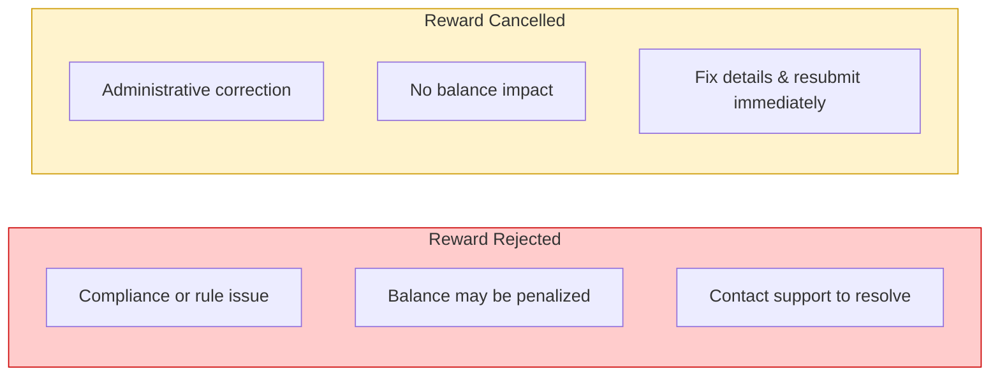
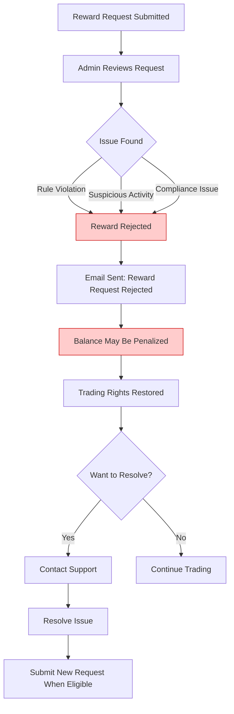
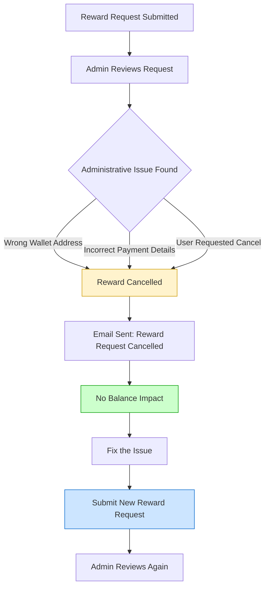
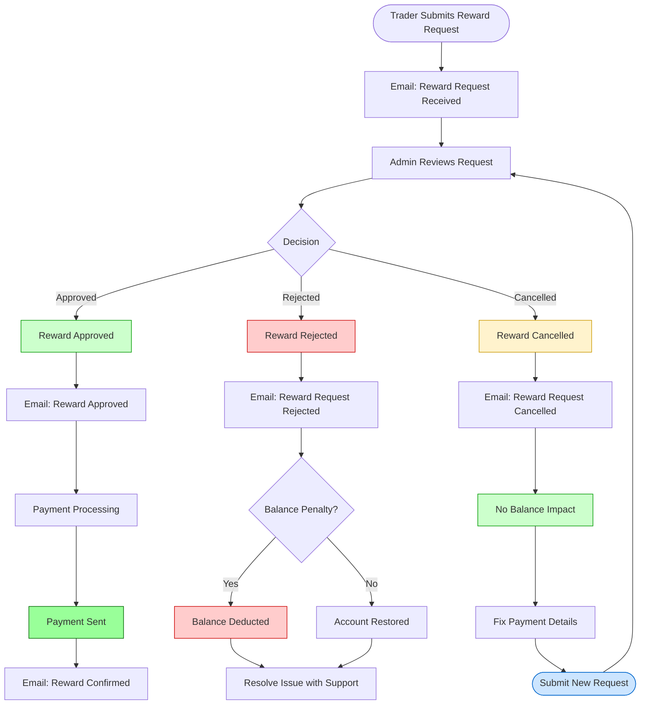

# Reward Rejected vs Reward Cancelled

## Terminology

The platform uses different terms for different types of withdrawals:

| Term | What It Means | Who Uses It |
|---|---|---|
| **Reward** | Withdrawing your **trading profits** from a funded account | Funded traders |
| **Affiliate Withdrawal** | Withdrawing your **referral commissions** from the affiliate program | Affiliates |

These are two completely separate systems. This document covers **Reward** (trading profit) requests only. For affiliate withdrawals, see the Affiliate section in [Email Notifications](./email-notifications).

---

## Quick Comparison

---

## Reward Rejected

A rejection means there was a **compliance, eligibility, or rule-related issue** with your reward request.

### When It Happens
- Trading rule violation detected
- Suspicious activity flagged on the account
- Compliance or verification requirements not met
- Account under review

### What It Means For Your Account
- Your account balance **may be penalized** (a deduction may be applied)
- Trading rights are restored after the rejection is processed
- You will receive an email with the specific rejection reason

### What You Should Do
1. Read the rejection reason in your email carefully
2. Check your account balance — it may have changed
3. Contact support if you believe the rejection was an error
4. Resolve any outstanding compliance issues before resubmitting

---

## Reward Cancelled

A cancellation is a **neutral administrative action**. No penalty is applied and your account is not affected.

### When It Happens
- Wrong wallet address was provided
- Incorrect bank or payment details
- You requested the cancellation yourself
- Admin needed to void the request for administrative reasons

### What It Means For Your Account
- **No balance impact** — your account stays exactly as it was
- **No penalty** — cancellation is not a negative action
- Trading metrics and account status are unaffected
- You can resubmit immediately

### What You Should Do
1. Read the cancellation reason in your email
2. Correct the issue (e.g., update your wallet address or bank details)
3. Submit a new reward request right away

---

## Side-by-Side Comparison

| | Reward Rejected | Reward Cancelled |
|---|---|---|
| **Reason** | Rule violation, compliance issue, suspicious activity | Wrong payment details, user request, admin correction |
| **Balance Impact** | May be penalized (deduction possible) | No impact at all |
| **Penalty** | Possible | None |
| **Can Resubmit?** | After resolving the issue | Immediately |
| **Action Required** | Contact support, resolve compliance issues | Fix payment details, resubmit |
| **Email Subject** | Reward Request Rejected | Reward Request Cancelled |
| **Severity** | Serious — review carefully | Minor — just a correction |

---

## Full Reward Request Lifecycle

---

## All Reward-Related Emails

| Email | When Sent | What It Means |
|---|---|---|
| **Reward Request Received** | Immediately after you submit | Your request is being reviewed |
| **Reward Approved** | Admin approves your request | Payment is being processed |
| **Reward Confirmed** | Payment is completed | Funds have been sent to you |
| **Reward Request Rejected** | Admin rejects your request | There was a compliance/rule issue |
| **Reward Request Cancelled** | Admin cancels your request | Administrative correction needed |

---

## FAQ

**Q: I received a "Reward Rejected" email. Did I lose money?**
A: Your reward amount was not paid out. Depending on the reason, a balance deduction may have been applied to your trading account. Check your dashboard balance and read the rejection reason in the email.

**Q: I received a "Reward Cancelled" email. Is my account affected?**
A: No. Cancellation has zero impact on your account balance or trading metrics. Simply fix the issue mentioned in the email and submit a new request.

**Q: Can a rejected reward be reversed?**
A: Contact support with your account details and the rejection email. If the rejection was made in error, the admin can reverse it.

**Q: How quickly can I resubmit after a cancellation?**
A: Immediately. There is no waiting period after a cancellation.

**Q: What's the difference between "Reward" and "Affiliate Withdrawal"?**
A: A Reward is your trading profit withdrawal from a funded account. An Affiliate Withdrawal is your referral commission cashout from the affiliate program. They are separate systems with separate processes.

---

**Questions?** Contact support through your dashboard or reply to the email notification you received.
